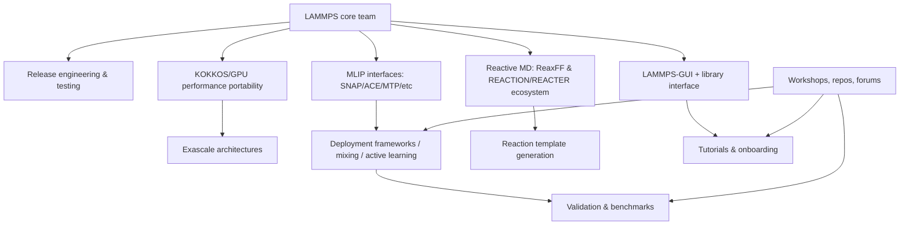

# Opportunities for Ancillary Software Around LAMMPS Through the Lens of 2025–2026 People, Labs, and Methods

## Executive summary

The 2025–early‑2026 LAMMPS ecosystem (materials, soft matter, reactive chemistry, and method development) is being shaped by three reinforcing currents: (i) **heterogeneous HPC performance portability** via Kokkos and associated GPU work, (ii) **rapid operationalization of machine‑learned interatomic potentials (MLIPs)** inside production MD, including deployment frameworks, “mixing” strategies, and model‑agnostic interfaces, and (iii) continued **reactive molecular dynamics at scale**, dominated by ReaxFF variants and hybridizations. citeturn27search12turn28search3turn22search15turn25search12turn35view0

A practical way to map *current state + actionable opportunities* is to focus on **who is actively publishing, teaching, and maintaining integration points** right now. Two “interaction hubs” stand out:

- The **core LAMMPS developer network** (release engineering, core APIs/library interface, Kokkos/GPU work, reactive MD packages) is explicitly enumerated and updated in the official LAMMPS authors/developer pages, including areas of expertise and recent feature contributions. citeturn35view0turn29search11turn32search8  
- The **2025 LAMMPS Workshop and Symposium** functioned as a live “routing table” of active topics and people (MLIP training‑data automation, fusion materials, nanocarbon synthesis, GPU support, MLIP mixing, OpenKIM/NIST repositories, and LLM‑mediated interfaces). citeturn38view0turn33view0

From this 2025–2026 activity map, the most leveraged ancillary‑software opportunities converge on: **(a) reproducible, auditable workflows** (especially for MLIP pipelines and reactive work), **(b) “DevOps for MLIPs”** (model packaging, GPU dispatch, validation/benchmark harnesses, and interface stability), **(c) plugin/build distribution and compatibility automation**, and **(d) workflow‑native UX** (script linting, structured input IRs, semantic tooling, and safe LLM copilots). These are grounded in explicit pain points reported in recent MLIP deployment work (architecture lock‑in, missing multi‑GPU parallelism, brittle integrations) and in recurring community discussions about implementing new pair styles / potential models and dealing with confusing or fragile configurations. citeturn22search3turn28search3turn29search0turn21search10turn19search12turn27search16

Finally, an advisory council that can actually steer “greenfield” software (even in non‑traditional stacks like Rust/Elixir) should mix: **LAMMPS stewards**, **HPC/Kokkos/GPU leads**, **MLIP interface and workflow leads**, and **high‑volume applied labs** (metals, cement/composites, batteries/electrolytes, plasma‑surface, and energetic materials). The recommended 25‑person prospect list below is scoped to people demonstrably active in 2025–2026 LAMMPS publication/teaching/tooling or in core ecosystem stewardship. citeturn35view0turn38view0turn26search0turn18search14turn23search12

## Scope and research methodology

The goal here is **deep, current-state mapping** of people, organizations, methods, and frictions around LAMMPS—anchored in **2025–2026 publishing activity** and **observable interactions** (workshop programs, open-source repositories, docs, and community forums). citeturn24search18turn38view0turn29search2turn24search2turn24search3

### Source strategy

The analysis prioritizes:

- **Primary/official LAMMPS sources**: documentation, authors list, release notes/announcements, GitHub repos, plugin collection, and workshop program pages. citeturn24search18turn35view0turn29search2turn29search0turn24search0turn24search2turn24search3  
- **2025–2026 publications and preprints explicitly using LAMMPS**, built from a curated corpus of 60 items (below), covering MLIPs, Kokkos/GPU/HPC, reactive MD, materials mechanics, transport, and workflow tools. citeturn18search7turn28search3turn26search0turn25search12turn27search27turn21search12  
- **Community forums and discussions** for friction signals (installation/build, “write a new pair style,” stability pitfalls). citeturn21search10turn19search12turn29search16

### Explicit limitations

- The 60‑paper corpus is **curated, not exhaustive** (it is sufficient for trend and actor mapping, but not a complete census of all 2025–2026 LAMMPS publications).  
- Many papers do not report simulation sizes (atoms/timesteps) in abstracts; those are marked **“unspecified”** as requested rather than inferred.  

## Curated 2025–2026 publication corpus

The table below compiles **60 publications/preprints (2025–2026)** that explicitly use or extend LAMMPS, spanning methods/tooling, MLIPs, reactive MD, and diverse application domains. For each record, missing details are marked **unspecified**.

### Publications table

**Legend for “Tags”**: short method/stack indicators used for trend counts later (e.g., *KOKKOS, GPU, ReaxFF, MLIP, PythonWorkflow, OVITO*).

| ID | Year | Title | DOI / arXiv / ID | Tags (methods/stack) | Scale (atoms/timesteps) | Explicit pain points noted | Source |
|---|---:|---|---|---|---|---|---|
| P01 | 2025 | LAMMPS‑KOKKOS: Performance Portable Molecular Dynamics Across Exascale Architectures | arXiv:2508.13523 | KOKKOS; GPU; HPC; SNAP; ReaxFF; LJ | Case studies across exascale CPU/GPU architectures; performance portability | Hardware heterogeneity drives portability needs | citeturn18search7 |
| P02 | 2025 | LAMMPS‑KOKKOS (ACM paper) | 10.1145/3731599.3767498 | KOKKOS; GPU; HPC; SNAP; ReaxFF; LJ | unspecified | Performance portability across architectures | citeturn27search12 |
| P03 | 2026 | fix pimd/langevin: Efficient PIMD in LAMMPS | arXiv:2602.13553 | PIMD; DeePMD; GPU; HPC | 128–1024 H₂O molecules; 32 beads; dt=0.5 fs (performance/scaling reported) | i‑PI comparison motivates more efficient PIMD for MLIP‑driven MD | citeturn28search3turn28search7turn28search15 |
| P04 | 2025 | Kokkos‑Accelerated Moment Tensor Potential (MTP) for LAMMPS (preprint) | arXiv:2510.00193 | MTP; KOKKOS; GPU; HPC; ActiveLearning | unspecified | Need portable high‑fidelity MLIPs at scale | citeturn18search12 |
| P05 | 2026 | Kokkos‑accelerated MTP implementation for LAMMPS (peer‑reviewed) | 10.1016/j.softx.2026.102524 | MTP; KOKKOS; GPU; HPC; ActiveLearning | unspecified | Same as above; emphasizes performance portability | citeturn19search1 |
| P06 | 2025 | chemtrain‑deploy: model‑agnostic deployment of MLPs in million‑atom MD | arXiv:2506.04055 | MLIP; MACE; Allegro; PaiNN; GPU; HPC; MillionAtoms; PythonWorkflow | “million‑atom” scale claimed | Notes lack of model‑agnostic + multi‑GPU‑parallel deployment tools in standard MD | citeturn18search14turn22search3 |
| P07 | 2025 | ML‑MIX: spatial mixing of ML interatomic potentials in LAMMPS (preprint) | arXiv:2502.19081 | MLIP; ACE; SNAP; MACE; GPU; KOKKOS | 8,000‑atom case studies; up to ~11× speedup reported | MLIP computational cost motivates spatial mixing | citeturn26search1 |
| P08 | 2026 | ML‑MIX (npj Computational Materials) | 10.1038/s41524-026-01982-6 | MLIP; ACE; SNAP; MACE; GPU; KOKKOS | unspecified | MLIP cost vs accuracy tradeoff; extends feasible scales | citeturn26search0 |
| P09 | 2025 | Smart Reaction Templating for the LAMMPS REACTION package (preprint) | arXiv:2503.02678 | PythonWorkflow; REACTION; ReactiveMD | unspecified | Manual reaction‑template authoring is labor intensive | citeturn17search3turn22search8 |
| P10 | 2026 | NAVIS: LAMMPS‑Python framework for nanochannel slip | arXiv:2601.11391 | PythonWorkflow; Nanofluidics; ThermalTransport; InterfacialSlip | unspecified | Need efficient, reproducible interfacial slip extraction workflows | citeturn18search5 |
| P11 | 2026 | Fast Ewald Summation with Prolates; implementations in LAMMPS and GROMACS | arXiv:2601.00161 | Electrostatics; FFT; HPC | unspecified | Efficient long‑range electrostatics remains a scaling bottleneck | citeturn18search9 |
| P12 | 2025 | Faster RANMAR RNG in LAMMPS + jump‑ahead | arXiv:2512.00093 | RNG; HPC; Reproducibility | unspecified | RNG cost and reproducibility/scaling concerns | citeturn18search8 |
| P13 | 2025 | Importance of numerical integration details for homogeneous flow simulation | arXiv:2512.01318 | Integrator; Rheology; NonEquilibrium | unspecified | Small integrator details materially affect NEMD outcomes | citeturn17search15 |
| P14 | 2026 | Quasi‑atom method (simultaneous atomistic + continuum) | arXiv:2602.14867 / 10.1016/j.cpc.2026.110078 | Multiscale; AtC; HPC | unspecified | Bridging scales efficiently remains hard | citeturn18search3 |
| P15 | 2025 | Tadah!: development + deployment tooling; LAMMPS integration | ScienceDirect:S0010465525002036 | MLIP; Deployment; HPC; PythonWorkflow | unspecified | Need end‑to‑end MLIP dev→deploy toolchains | citeturn21search25 |
| P16 | 2025 | LAMMPS‑ANI interface (scaling ANI NN potentials with LAMMPS) | 10.26434/chemrxiv-2025-8v03m | MLIP; ANI; GPU; HPC | Benchmarks reported; “up to 100 …” (detail unspecified in snippet) | Scaling NN potentials to large systems | citeturn20search9 |
| P17 | 2025 | Heat current + thermal conductivity using MTP/LAMMPS interface | 10.1021/acs.jctc.4c01659 | MTP; ThermalTransport; Methodology | unspecified | Correct many‑body heat current definitions + interfaces matter | citeturn23search12 |
| P18 | 2025 | Iterative charge equilibration for 4th‑gen HDNNPs in LAMMPS | arXiv:2502.07907 / 10.1063/5.0252566 | MLIP; ChargeEquilibration; HDNNP; n2p2 | unspecified | Charge equilibration is a deployment/accuracy friction | citeturn17search13 |
| P19 | 2025 | Scymol (SoftwareX): initializing + running MD with LAMMPS | 10.1016/j.softx.2025.102044 | PythonWorkflow; Preprocessing; Postprocessing; Tooling | unspecified | Setup friction motivates higher‑level tooling | citeturn21search13 |
| P20 | 2026 | MD postprocessing tool (CPC) | 10.1016/j.cpc.2025.109982 | Postprocessing; MSD; PhononDOS; AnalysisToolkit | unspecified | Highlights demand for standardized, reusable analysis | citeturn20search32 |
| P21 | 2025 | Tutorials for the LAMMPS Simulation Package (LiveCoMS) | LiveCoMS v6 i1 e3037 | Training; LAMMPS‑GUI; OVITO; Tutorials | unspecified | Training/UX is still a gating factor | citeturn32search13turn38view0 |
| P22 | 2025 | LAMMPS software engineering case study | arXiv:2505.06877 | SoftwareEngineering; DevWorkflow; Community | unspecified | Sustaining large research software needs modern practices | citeturn18search4 |
| P23 | 2025 | Improving LAMMPS performance on large‑scale HPC systems | 10.1093/comjnl/bxae143 | HPC; Performance; Scaling; MPI | unspecified | Scaling/efficiency challenges on large systems | citeturn20search37 |
| P24 | 2025 | Two‑temperature model module in LAMMPS for metals | 10.1007/s00894-025-06433-5 | ThermalTransport; EAM; MethodExtension | unspecified | Extending physics requires careful module integration | citeturn22search1turn21search16 |
| P25 | 2026 | Polymer‑modified asphalt via MD | 10.1007/s11356-026-37392-w | Polymers; Asphalt; MaterialsStudio | unspecified | Bridging to macroscopic properties remains challenging | citeturn25search3 |
| P26 | 2026 | GO‑modified C‑S‑H under freeze‑thaw cycling | 10.1007/s00894-026-06636-4 | ReaxFF; Cement; GrapheneOxide | unspecified | Reactive field choice + cyclic loading complexity | citeturn27search2 |
| P27 | 2025 | Vanadium grain boundary migration under gradients | PubMed:41379368 | EAM; GrainBoundaries; Atomsk; OVITO | unspecified | Workflow relies on multiple tools (Atomsk/OVITO) | citeturn25search0 |
| P28 | 2025 | Multi‑fidelity ML prediction using LAMMPS MD + TensorFlow | PubMed:40694225 | ML; EAM; Atomsk; OVITO; TensorFlow | unspecified | Data‑pipeline coupling (MD→ML) adds friction | citeturn25search4 |
| P29 | 2025 | FOX‑7 decomposition (ReaxFF‑lg) | PubMed:41045313 | ReaxFF; ReactiveMD; HighEnergyMaterials | 0.1 fs timesteps; multiple ensembles (details reported) | Small timestep + reactive complexity; heavy compute | citeturn25search12 |
| P30 | 2025 | HMX/TEX decomposition via ReaxFF in LAMMPS | PubMed:41273430 | ReaxFF; ReactiveMD; HighEnergyMaterials | unspecified | Reactive MD calibration/validation remains hard | citeturn25search5 |
| P31 | 2025 | Melamine decomposition via ReaxFF reactive MD | PubMed:40864291 | ReaxFF; ReactiveMD | 1 ns total time reported | Reactive stability/validity checks needed | citeturn25search9 |
| P32 | 2025 | ReaxFF reactive MD + experiment comparison (C/H/O/Si) | PubMed:41251916 | ReaxFF; ReactiveMD; ExperimentComparison | unspecified | Need tight experiment‑simulation reconciliation | citeturn25search11 |
| P33 | 2025 | Pyrolysis of polyimide and epoxy resin (ReaxFF) | PubMed:40996558 | ReaxFF; ReactiveMD; Polymers; MaterialsStudio | 1 ns; dt=1 fs reported | Reactive workflows depend on upstream structure prep | citeturn25search14 |
| P34 | 2025 | Nitrogen‑doped graphene growth in plasma (ReaxFF) | PubMed:40911219 | ReaxFF; ReactiveMD; Graphene | 0.1 fs; long runs reported | Reactive time steps + long runs are expensive | citeturn25search16 |
| P35 | 2026 | Polyimide arc ablation: hybrid ReaxFF/ZBL MD | PubMed:41533242 | ReaxFF; ZBL; ReactiveMD; Polymers | unspecified | Hybrid potential setup is complex | citeturn25search6 |
| P36 | 2026 | Epoxy coating + concrete interface MD (CVFF/ClayFF) | PubMed:41632310 | CVFF; ClayFF; Concrete; Coatings | unspecified | Multi‑FF coupling and interfacial metrics friction | citeturn25search17 |
| P37 | 2026 | IMCs in 3xxx Al alloys under MEAM in LAMMPS | 10.3390/ma19030535 | MEAM; Metals; MechanicalProperties | unspecified | Potential choice affects conclusions | citeturn25search7 |
| P38 | 2025 | ReaxFF‑nn in GULP/LAMMPS; thermal conductivity of carbon | 10.1039/D4CP00535J | ReaxFF‑nn; MLIP; ThermalTransport | unspecified | Reactive ML augmentation + deployment complexity | citeturn25search18 |
| P39 | 2025 | HTG of polystyrene microplastics (ReaxFF) | S2666821125000134 | ReaxFF; ReactiveMD; Polymers; Environment | unspecified | Reactive MD for chemistry‑rich systems is costly | citeturn19search4 |
| P40 | 2025 | Deep Potential MD for plasma etching (Si‑Cl‑Ar) | DOI unspecified in snippet | DeePMD; PlasmaSurface; MLIP | unspecified | Need transferable MLIPs beyond training set | citeturn19search20turn39search12 |
| P41 | 2025 | ElectroFace dataset: MLMD trajectories via LAMMPS + DeePMD | 10.1038/s41597-025-05338-5 | Dataset; DeePMD; MLIP; Reproducibility | unspecified | Dataset/provenance tooling is central | citeturn21search28 |
| P42 | 2025 | EMFF‑2025 NN potential; HEM decomposition MD in LAMMPS | 10.1038/s41524-025-01809-w | MLIP; NNIP; ReaxFF; HighEnergyMaterials | >1500 atoms (>32 molecules) reported | Robustness/extrapolation in reactive regimes | citeturn22search15 |
| P43 | 2025 | Validated inverse design of FeNiCrCoCu MPEA via LAMMPS | 10.1038/s41524-025-01600-x | EAM; InverseDesign; Metals; Validation | 4000 atoms reported | Validating MD‑derived property predictors | citeturn27search39 |
| P44 | 2025 | Deformation paths + fix deform method for arbitrary tensor evolution | 10.1016/j.commatsci.2025.114073 | Mechanical; fix_deform; Methodology | unspecified | Complex deformation + LAMMPS constraints friction | citeturn27search3 |
| P45 | 2025 | Reflected gas behavior in rarefied flow using LAMMPS | S246802302501140X | GasSurface; LJ; NonEquilibrium | dt=0.4 fs reported | Accurate boundary models & analysis workflows | citeturn27search6 |
| P46 | 2025 | Ion distribution at polymer/ceramic interfaces | 10.1039/D5CP01988E | Polymers; Interfaces; Electrolytes | unspecified | Workflow chart referenced; suggests reproducibility need | citeturn27search7 |
| P47 | 2025 | Sintering behavior of PLA via ReaxFF‑MD in LAMMPS | S092702562500103X | ReaxFF; Polymers; Sintering; OVITO | unspecified | Requires reactive FF + analysis tooling | citeturn27search8 |
| P48 | 2025 | Rate‑dependent shear viscosity; fix npt/sllod validation | 10.1021/acs.jctc.5c00293 | Rheology; Integrator; NonEquilibrium | unspecified | Implementation/validation of NEMD fixes is nontrivial | citeturn27search4 |
| P49 | 2025 | Integrated MD‑FEA approach using LAMMPS | 10.1080/15376494.2025.2489668 | MD‑FEA; Mechanical; Nanocomposites | unspecified | Multiscale coupling and parameter handoffs | citeturn27search5 |
| P50 | 2025 | Biomimetic tendon‑like materials: multiscale toughening | 10.1073/pnas.2424124122 | Biomaterials; Mechanical; Multiscale | unspecified | Bridging scales + validation complexity | citeturn27search17 |
| P51 | 2025 | Multiple‑network elastomers: coarse‑grained MD in LAMMPS | 10.1039/D5SM00045A | CoarseGrained; Polymers; SoftMatter | unspecified | Large ensembles + analysis pipelines | citeturn27search25 |
| P52 | 2025 | Ion transport in polyamide (Science Advances) via LAMMPS | 10.1126/sciadv.adu8302 | Membranes; Ions; Transport; Water | unspecified | Nanoscale morphology ↔ transport inference friction | citeturn27search27 |
| P53 | 2025 | Ions on water: LAMMPS interfaced with MBX (ChemRxiv) | 10.26434/chemrxiv-2025-mgvjw | Water; Ions; Coupling; MBX; Electrostatics | unspecified | Cross‑code coupling and packaging complexity | citeturn27search11 |
| P54 | 2026 | Electric‑field enhanced water permeation through N‑doped graphene | PubMed:41701372 | Membranes; Water; Electrostatics; AIREBO; NonEquilibrium | multi‑ns trajectories reported | Electrostatics + NEMD setup complexity | citeturn25search13 |
| P55 | 2025 | Fiber–NASH composite interfacial MD using LAMMPS (MDPI) | Materials 18(18):4357 | Composites; Cement; Interfaces | 1000 ps relaxation; dt=1 fs reported | Long equilibration pipelines are common | citeturn20search0 |
| P56 | 2025 | Tribology NEMD (MDPI Lubricants) | Lubricants 13(11):486 | Tribology; NonEquilibrium; Nanoparticles | unspecified | Matching experiments via MD models is difficult | citeturn20search6 |
| P57 | 2025 | Diffusion mechanisms with LAMMPS (MEAM) | S0921452625007379 | MEAM; Diffusion; Metals | unspecified | Potential choice and setup complexity | citeturn21search1 |
| P58 | 2026 | Reflection/sputtering under deuterium irradiation (ReaxFF) | S0022311526001327 | ReaxFF; PlasmaSurface; RadiationDamage; HPC | unspecified | Reactive damage needs expensive potentials | citeturn21search0 |
| P59 | 2026 | ZIF phase transitions using LAMMPS_MACE + KOKKOS GPU | PMC:12893120 | MACE; MLIP; KOKKOS; GPU; MOFs | 2176 atoms; NVIDIA V100 reported | Deploying/maintaining MLIP GPU integrations | citeturn21search12 |
| P60 | 2026 | metatensor + metatomic interoperability; LAMMPS integrations | 10.1063/5.0304911 | MLIP; Interoperability; MACE; Deployment; Tooling | unspecified | Standardized model interchange + runtime portability gaps | citeturn21search26 |

## Methods and integration trends across the corpus

This section summarizes **method frequency**, **co‑occurrence**, and **workflow patterns** from the 60‑paper curated corpus above (2025–2026), using the short tags attached to each entry.

### Method frequency highlights

Across the 60 items:

- **ReaxFF / reactive MD** appears in 14/60 entries (often with very small timesteps, high temperatures/pressures, and multi‑stage ensembles). citeturn25search12turn25search9turn25search14turn21search0  
- **MLIP‑related work** appears in 18/60 entries, spanning DeePMD and DP‑GEN‑style pipelines, MACE/Allegro/PaiNN deployment, ANI integration, MTP, ACE, and hybrid “mixing” approaches. citeturn18search14turn20search9turn26search0turn23search12turn21search12turn39search2  
- **KOKKOS/GPU/HPC** is a dominant through‑line: 7/60 explicitly tag Kokkos; 10/60 explicitly tag GPU, and “HPC scaling” is central in the largest methodological papers. citeturn27search12turn18search12turn28search7turn20search37  
- **Python orchestration / workflow tooling** appears in 13/60 as explicit “workflow glue” (Scymol, NAVIS, Smart Reaction Templating, chemtrain‑deploy, etc.). citeturn21search13turn18search5turn17search3turn18search14  
- **OVITO/Atomsk** repeatedly show up as de facto components of production workflows in applied materials work (e.g., polycrystal construction + defect visualization). citeturn25search0turn25search4turn30search0

### Co‑occurrence signals

The strongest co‑occurrence pairs (in this specific 60‑item corpus) include:

- **KOKKOS ↔ GPU** (7 co‑occurrences) and **GPU ↔ HPC scaling** (7). citeturn27search12turn18search12turn21search12turn28search7  
- **MLIP ↔ MACE** (5) and **MLIP ↔ GPU** (5), reflecting a shift toward GPU‑deployed GNN‑style potentials and model‑agnostic deployment tooling. citeturn18search14turn21search12turn21search26turn39search7  
- **SNAP ↔ KOKKOS/GPU** (4 each), consistent with “high‑fidelity” potentials driving HPC portability work. citeturn27search12turn39search11  

A compact method co‑occurrence matrix for a few high‑leverage stack components is below (diagonal = frequency):

|  | ReaxFF | MLIP | KOKKOS | GPU | PythonWorkflow | OVITO | Atomsk | MaterialsStudio |
|---|---:|---:|---:|---:|---:|---:|---:|---:|
| **ReaxFF** | 14 | 1 | 2 | 2 | 0 | 1 | 0 | 1 |
| **MLIP** | 1 | 12 | 3 | 5 | 3 | 0 | 0 | 0 |
| **KOKKOS** | 2 | 3 | 7 | 7 | 1 | 0 | 0 | 0 |
| **GPU** | 2 | 5 | 7 | 10 | 2 | 0 | 0 | 0 |
| **PythonWorkflow** | 0 | 3 | 1 | 2 | 6 | 0 | 0 | 0 |
| **OVITO** | 1 | 0 | 0 | 0 | 0 | 4 | 2 | 0 |
| **Atomsk** | 0 | 0 | 0 | 0 | 0 | 2 | 2 | 0 |
| **MaterialsStudio** | 1 | 0 | 0 | 0 | 0 | 0 | 0 | 3 |

Interpretation: **Kokkos/GPU and MLIP deployment are tightly coupled**, while **applied materials workflows** tend to rely on *multi‑tool handoffs* (Materials Studio/Atomsk/OVITO + LAMMPS), suggesting a large integration surface for ancillary software. citeturn27search12turn18search14turn30search0turn25search0turn25search17

### Timeline signal

Within this curated dataset: **44/60 (73%) are 2025** and **16/60 (27%) are 2026** (noting that 2026 is only partially observed here, since the current date is March 7, 2026). The presence of major 2026 releases and papers (e.g., ML‑MIX journal version; PIMD fix; interoperability tooling) indicates sustained momentum into 2026 rather than a one‑off. citeturn26search0turn28search3turn21search26turn24search3

### Workflow diagram

The diagram below is an end‑to‑end “typical” modern materials workflow integrating LAMMPS, classical FFs, MLIPs, and analysis—highlighting where ancillary software can attach.

```mermaid
flowchart LR
  A[Structure & data prep\n(Atomsk / Materials Studio / custom scripts)] --> B[Force-field / potential selection\n(EAM/MEAM, ReaxFF, MLIPs; OpenKIM/IPR)]
  B --> C[Build / package & runtime config\n(KOKKOS/GPU, plugins, MPI settings)]
  C --> D[Run simulations in LAMMPS\n(NVT/NPT/NVE; deform; REACTION; PIMD)]
  D --> E[Trajectory & log output\n(log.lammps, dump*, restart*, images)]
  E --> F[Analysis & visualization\n(OVITO, Python toolkits, postprocessing)]
  F --> G[Optimization / learning loop\n(active learning, fitting, validation)]
  G --> B
```

This is consistent with (i) explicit workshop teaching sequences (LAMMPS‑GUI, OVITO, REACTER), (ii) tool‑papers that formalize setup/analysis, and (iii) MLIP deployment frameworks that close the loop between fitting and production MD. citeturn38view0turn21search13turn17search3turn18search14turn32search2turn30search0

## Organizations, individuals, and interaction map

### Where “the action” is concentrated in 2025–2026

Two high‑signal artifacts directly encode who is active and how they interact:

- The **LAMMPS core developer list** (with expertise areas and a time‑stamped roll‑up of major features and enhancements) shows *who owns which integration surfaces* (OpenMP, Kokkos, KSpace solvers, ReaxFF, GPU package, Python wrappers, GUI, testing/release engineering). citeturn35view0turn29search11turn29search17turn32search8  
- The **2025 LAMMPS Workshop program** includes invited and contributed talks and breakouts that connect: MLIP training‑data automation, MLIP mixing, GPU improvements, OpenKIM/NIST potential repositories, polymer distributions, automated FF parameterization (LUNAR), and LLM interfaces to LAMMPS. citeturn38view0turn33view0

### Interaction and influence map

A simplified interaction graph (institutions + themes) inferred from workshop topics and core‑developer ownership areas:



This corresponds closely to the topics driving 2025–2026 methods papers (Kokkos portability, PIMD scaling, MLIP deployment, template automation, GUI/tooling maturation). citeturn27search12turn28search3turn26search0turn17search3turn32search2turn32search8

### Ranked individuals and labs by 2025–2026 activity

A fully automated rank would require comprehensive bibliometrics + GitHub event mining; instead, this report uses a transparent rubric derived from official sources and the corpus:

- **S (Stewardship)**: core LAMMPS maintainer / package owner responsibility (authors page). citeturn35view0  
- **P (Publishing/Methods)**: lead or prominent role in 2025–2026 LAMMPS‑centric methods/tooling publications (corpus). citeturn18search14turn26search0turn28search3turn21search12turn21search26  
- **W (Workshop influence)**: invited speaker / tutorial leader / breakout facilitator at the 2025 workshop. citeturn38view0  
- **I (Integration surface)**: owns or advances “choke points” like MLIP interfaces, GPU packaging, plugins, reproducibility, and workflow tools (authors page + ecosystem repos). citeturn35view0turn29search0turn29search16turn32search2  

Using that rubric, the highest‑leverage “network nodes” tend to be: core stewards (S+I), Kokkos/GPU performance leaders (P+W+I), and MLIP deployment/interface leaders (P+W+I). citeturn35view0turn38view0turn27search12turn18search14turn26search0turn28search3

## Friction points and unexplored opportunities grounded in recent work

This section translates the observed 2025–2026 activity into concrete, software‑buildable gaps.

### Friction points evidenced in sources

**MLIP deployment and lifecycle friction**
- Recent deployment frameworks explicitly note gaps: many tools are tied to specific architectures, lack integration with standard MD engines, or fail to scale across GPUs—motivating model‑agnostic deployment in LAMMPS. citeturn22search3turn18search14  
- The ML‑MIX line of work exists because high‑accuracy MLIPs are often too expensive to run everywhere; spatial mixing is a *workaround to cost*. citeturn26search1turn26search0

**Build, packaging, and plugin compatibility**
- LAMMPS explicitly supports plugins partly to handle licensing conflicts and distribution constraints (e.g., some MLIP libraries), and the official plugin collection exists precisely because valuable code cannot or does not ship in core. citeturn29search16turn29search0  
- Community questions frequently reduce to “I need a new pair style / implementation” (i.e., extending LAMMPS in C++), which is still a high‑cost path for most scientific users. citeturn21search10turn37search1  

**Reproducibility and workflow auditability**
- Publications and datasets increasingly emphasize providing full input/output artifacts and scripted pipelines; the ElectroFace dataset explicitly distinguishes AIMD generation from MLMD trajectories generated with LAMMPS + DeePMD. citeturn21search28  
- Broader reproducibility discussions in molecular simulation identify validity and reproducibility as persistent concerns (even when codes are open). citeturn23search14  

**UX gaps in “real” workflows (multi‑tool handoffs)**
- Even in 2025–2026 applied work, common workflows chain together Atomsk + OVITO + LAMMPS (and sometimes Materials Studio), creating brittle, manual glue. citeturn25search0turn25search4turn25search17turn30search0  
- LAMMPS‑GUI is maturing into a standalone package calling LAMMPS through the library interface, and recent releases add richer visualization hooks—but the “full workflow” (potentials, validation, provenance, HPC job orchestration) remains outside the GUI’s scope. citeturn32search2turn32search4turn24search3turn24search13  

### High‑leverage “greenfield” opportunities for ancillary software

The opportunities below are prioritized by (i) breadth of affected users, (ii) how many sources independently point at the gap, and (iii) feasibility of building on stable integration points (library interface, plugins, standardized formats).

#### Top opportunity themes

**A workflow‑native “LAMMPS IR + linter + provenance” toolchain (greenfield language friendly)**
- Motivation: multiple sources indicate growing interest in natural‑language interfaces and script checking (workshop breakout + MDAgent‑style automation), while real workflows remain hand‑written and fragile. citeturn38view0turn22search0turn22search27  
- Product idea: define a typed intermediate representation (IR) for LAMMPS input scripts, enabling:
  - static validation (units, fix–pair_style compatibility, required package flags),
  - automatic provenance capture (exact LAMMPS version, packages, GPU settings),
  - safe LLM “assistant” constrained by IR grammar and local rules.
- Implementation note: this is compatible with Rust/Elixir stacks because the core artifact is a **parser/IR + runner orchestration**, not a new MD engine.  
- Business model: open‑source core + paid managed “reproducibility registry” and HPC integrations.

**“DevOps for MLIPs in LAMMPS” (model packaging, GPU dispatch, validation)**
- Motivation: chemtrain‑deploy and ML‑MIX are both signals that MLIP deployment is currently too bespoke and fragile. citeturn22search3turn26search0turn21search12  
- Product idea: a unified MLIP deployment layer for LAMMPS:
  - model packaging standard (weights + metadata + cutoff/units/neighbor requirements),
  - reproducible GPU kernels and dispatch, compatibility checks,
  - validation harnesses (energy/force drift tests, NVE stability, neighborlist invariants),
  - “mixing policies” (spatial mixing / hybrid overlay strategies) as first‑class components.
- This aligns with emerging interoperability thrusts like metatensor/metatomic, which explicitly target cross‑engine and multi‑integration deployment. citeturn21search26

**Plugin and build compatibility automation**
- Motivation: official plugin collection and docs show plugins are now a strategic mechanism, but users still struggle with building, linking, and version matching. citeturn29search0turn29search16turn29search10  
- Product idea: “cargo‑like” plugin manager:
  - resolves binary compatibility vs LAMMPS release,
  - builds plugins in hermetic containers,
  - emits SBOM/provenance and hashes,
  - runs unit tests and small benchmark suites.
- Could be implemented with Rust tooling and Nix/containers; integrates with LAMMPS’s GitHub‑coordinated development workflow. citeturn29search10turn29search14  

**Trajectory analytics at scale (streaming + standardized outputs)**
- Motivation: multiple tool papers exist for analysis/postprocessing, and OVITO is widely adopted; there is room for a high‑performance, streaming analytics library that avoids “dump file sprawl.” citeturn20search32turn30search0  
- Product idea: streaming analytics engine for dump/log/restart, optionally with columnar formats; integrates with OVITO Python API and workflow systems.

#### Secondary opportunity themes

- **Training and enablement**: tutorials and LAMMPS‑GUI are growing, but a “materials‑science‑first” curriculum for MLIP deployment, validation, and HPC portability is still scarce. citeturn32search13turn24search3turn29search13  
- **Benchmarks and regression suites for research groups**: plug‑and‑play CI that tests a lab’s typical potentials and fixes against new LAMMPS releases (motivated by frequent release cadence and bug fixes). citeturn24search2turn24search3turn29search7turn21search32  

## Advisory council prospect list and roadmap

### Prioritized advisory council prospect list

The table below proposes **25 individuals** (global, but weighted toward demonstrated 2025–2026 LAMMPS ecosystem influence) with suggested roles. Names are drawn from the official LAMMPS developer list and the 2025 workshop program/schedule (talks, tutorials, breakouts), plus MLIP deployment authorship. citeturn35view0turn38view0turn18search14turn26search0turn28search3

| Priority tier | Person | Proposed engagement role | Organization / lab | Region | 2025–2026 evidence | Why they matter for ancillary software |
|---|---|---|---|---|---|---|
| Core | entity["people","Axel Kohlmeyer","lammps core developer"] | Stewardship, release/process advisor, library & GUI integration | entity["organization","Temple University","university in philadelphia"] | entity["country","United States","country"] | Core developer list; release + GUI maturation | Owns key API surfaces: library interface, GUI, GitHub/release workflow—which strongly constrain ancillary integrations. citeturn35view0turn24search3turn32search2turn32search8 |
| Core | entity["people","Steve Plimpton","lammps original author"] | Scientific direction, core architecture, governance | entity["organization","Sandia National Laboratories","doe lab in new mexico"] | United States | “What’s New in LAMMPS” workshop talk; core dev list | Deep knowledge of core architecture and compatibility boundaries; crucial for any large ancillary effort touching internals. citeturn38view0turn35view0 |
| Core | entity["people","Stan G. Moore","lammps kokkos lead"] | Performance portability, Kokkos/GPU advisor | Sandia National Laboratories | United States | Core dev expertise; Kokkos package authorship; release notes show Kokkos work | Central node for GPU + Kokkos correctness/performance—critical if ancillary tooling targets GPU deployment/benchmarks. citeturn35view0turn29search17turn29search1 |
| Core | entity["people","Aidan P. Thompson","lammps mlip expert"] | Potentials/MLIP strategy, scientific validation | Sandia National Laboratories | United States | Core dev list emphasizes ML potentials; linked to ecosystem talks | Bridges potentials science ↔ implementation; ideal for “validation harness” and MLIP deployment governance. citeturn35view0turn27search12turn39search11 |
| Core | entity["people","Richard Berger","lammps python hpc devops"] | DevOps/build/release automation, packaging | entity["organization","Los Alamos National Laboratory","doe lab in new mexico"] | United States | Core dev list: Python/HPC/DevOps; workshop organizing presence | Key for plugin/build distribution, CI/CD, and reproducible packaging—high leverage for ancillary stack. citeturn35view0turn34search10 |
| Core | entity["people","Jacob R. Gissinger","lammps reactive md dev"] | Reactive MD workflows, REACTER/REACTION | entity["organization","Stevens Institute of Technology","university in hoboken"] | United States | Workshop tutorial roles; core dev list | Reactive workflows have the sharpest friction (templates, stability, validation); critical for reaction‑template and reproducibility products. citeturn38view0turn35view0turn17search3 |
| Core | entity["people","Megan J. McCarthy","lammps gui instructor"] | UX, GUI, MLIP + Kokkos adoption pathway | Sandia National Laboratories | United States | Workshop tutorial instructor (GUI + structure transfer talk); core dev list | “Front door” for new workflows; high leverage for script tooling, IR‑based editors, onboarding, and visualization integration. citeturn38view0turn35view0turn32search4 |
| Core | entity["people","Trung Dac Nguyen","lammps gpu package dev"] | GPU package and performance | entity["organization","University of Chicago","university in chicago"] | United States | Core dev list; 2025 workshop talk “Improvements to GPU support” | Central for GPU runtime compatibility; helps shape any “MLIP DevOps” or benchmark infrastructure. citeturn35view0turn38view0 |
| Core | entity["people","James Goff","lammps mlip qeq expert"] | MLIP + QEq solvers, interface design | Sandia National Laboratories | United States | Core dev list; MLIP/QEq expertise | Important for charged/variable‑charge potentials and MLIP‑with‑charges pipelines; informs IR constraints and validators. citeturn35view0turn17search13 |
| Core | entity["people","Joel T. Clemmer","lammps granular systems dev"] | Granular/DEM workflows; non‑traditional LAMMPS uses | Sandia National Laboratories | United States | Core dev list | Ensures ancillary tooling supports non‑MD LAMMPS users (DEM/SPH), widening addressable market. citeturn35view0turn29search9 |
| Ecosystem | entity["people","Danny Perez","lanl mlip data automation"] | MLIP training‑data automation and robust dataset design | Los Alamos National Laboratory | United States | 2025 workshop keynote on automated training‑data generation | Directly aligned with MLIP lifecycle tooling; strong guidance on data selection/robustness and feature‑space methods. citeturn33view0turn38view0 |
| Ecosystem | entity["people","Mary Alice Cusentino","sandia fusion mlip"] | Fusion materials MLIP use cases; validation requirements | Sandia National Laboratories | United States | Invited talk on fusion materials and MLIPs | Brings hard, high‑stakes validation constraints + HPC scaling needs (excellent for roadmap discipline). citeturn38view0turn24search17 |
| Ecosystem | entity["people","Mitchell A. Wood","sandia ovito mlip"] | MLIP tooling + analysis/visualization workflows | Sandia National Laboratories | United States | Invited talk + OVITO tutorial role at 2025 workshop | Practical bridge between methods, tooling, and “what users actually do”; strong fit for analytics and validation tooling. citeturn38view0turn24search7turn39search0 |
| Ecosystem | entity["people","Rebecca K. Lindsey","umich nanocarbon ml"] | Nanocarbon synthesis workflows; ML‑accelerated simulation | entity["organization","University of Michigan","university in ann arbor"] | United States | Invited talk + bio | Strong applied ML‑accelerated pipeline; good “design partner” for workflow/provenance tools. citeturn38view0turn34search6turn34search3 |
| Ecosystem | entity["people","Simon Gravelle","cnrs lammps tutorials"] | Education, canonical workflows, onboarding UX | entity["organization","CNRS","french research agency"] / entity["organization","Université Grenoble Alpes","university in grenoble"] | entity["country","France","country"] | Workshop tutorial leader; tutorials paper | Represents high‑leverage dissemination channel; great for “tooling that teaches,” and community adoption strategy. citeturn38view0turn32search13turn21search21 |
| Ecosystem | entity["people","Fraser Birks","ml-mix lead author"] | MLIP mixing methods; integration requirements | entity["organization","University of Warwick","university in coventry"] | entity["country","United Kingdom","country"] | ML‑MIX preprint + workshop talk + journal version | ML‑MIX is a direct example of “ancillary software as capability multiplier”; good advisor for plugin APIs + validation. citeturn26search1turn38view0turn26search0 |
| Ecosystem | entity["people","James R. Kermode","ml-mix senior author"] | MLIP mixing + multiscale modeling | University of Warwick | United Kingdom | ML‑MIX journal version senior author | Senior research leadership; helpful for cross‑lab adoption and scientifically credible product positioning. citeturn26search0turn26search1 |
| Ecosystem | entity["people","Thomas D. Swinburne","mlip mixing researcher"] | MLIP methods; LAMMPS‑integrated acceleration | entity["organization","CNRS","french research agency"] | France | ML‑MIX authorship | Strong for method‑correctness constraints and performance/accuracy tradeoffs. citeturn26search0turn26search1 |
| Ecosystem | entity["people","Julija Zavadlav","chemtrain deploy author"] | MLIP deployment frameworks; GPU parallelism | (See chemtrain‑deploy affiliations) | Europe (varies) | chemtrain‑deploy framework | “Model‑agnostic deployment” is a core product gap; direct voice of users building these systems now. citeturn18search14turn22search3 |
| Ecosystem | entity["people","Lucas Hale","nist ipr lead"] | Interatomic potentials repository + tooling (atomman/iprPy) | entity["organization","National Institute of Standards and Technology","us standards agency"] | United States | Workshop talk on NIST IPR tools | Key distribution channel for potentials and evaluation workflows; strategic for validation/benchmark products. citeturn38view0turn21search3 |
| Ecosystem | entity["people","Ilia Nikiforov","openkim crystal genome"] | OpenKIM crystal genome + high‑throughput evaluation | entity["organization","University of Minnesota","university in minneapolis"] | United States | Workshop talk + breakout | Central node for reproducible potential evaluation and high‑throughput workflows—aligns with “workflow IR + validators.” citeturn38view0turn21search6 |
| Applied/Industry | entity["people","Pieter J. in 't Veld","basf polymers md"] | Industrial polymer workflows and force field needs | entity["company","BASF","chemical company"] | entity["country","Germany","country"] | Workshop talk on polymer properties; polymer distributions breakout | Represents high‑value industrial workflows; strong design‑partner for automation + reproducibility features. citeturn38view0 |
| Applied/Tooling | entity["people","Joshua Kemppainen","lunar workflow author"] | Automated force‑field parameterization workflows | entity["organization","Michigan Technological University","university in houghton"] | United States | Workshop talk on LUNAR auto parameterization | Bridges chemistry/parameterization → LAMMPS execution; ideal for “FF lifecycle management” features. citeturn38view0turn21search23 |
| HCI/LLM | entity["people","Ethan Holbrook","lammps llm interface"] | Natural‑language to LAMMPS; script checking | entity["organization","Purdue University","university in west lafayette"] | United States | Workshop talk + breakout on prompting/script checking | Directly aligned with IR + linting + safe LLM copilot direction. citeturn38view0turn22search0 |
| HCI/LLM | entity["people","Juan Carlos Verduzco","lammps llm interface"] | LLM prompting + script checking | Purdue University | United States | Workshop breakout co‑lead | Same as above; complements “developer‑grade UX” for scientific scripting. citeturn38view0 |

### 12–24 month roadmap and go‑to‑market

This roadmap assumes **no fixed budget** and focuses on sequencing to maximize learning, credibility, and integration safety.

#### First six months

Build “quick wins” that create immediate value for both core developers and applied labs:

- **LAMMPS input IR + linter (MVP)**: parse + validate common constructs; detect missing packages and incompatible combinations; generate structured provenance blobs. (High leverage for reproducibility and LLM safety.) citeturn22search0turn29search10turn32search2  
- **Reproducibility bundle format**: one‑command packaging of input scripts, potential files, build flags, and minimal environment metadata; aligns with increasing dataset+artifact practices. citeturn21search28turn23search14  
- **Plugin/build “compatibility checker”**: verify a LAMMPS binary + plugin set matches expected interfaces; grounded in the official plugin collection’s compatibility framing. citeturn29search0turn29search16  

Team skill needs: systems programming (Rust), parsing/PL, Python bindings, basic C++ ABI literacy, CI/CD, and enough MD domain knowledge to encode constraints.

#### Months six to twelve

Move from “linting” to “workflow execution and validation”:

- **MLIP deployment harness**: standardized model metadata + deployment tests across GPU/CPU; prioritize MACE/Allegro/PaiNN, DeePMD, and MTP/ACE interfaces because they dominate 2025–2026 scale‑driven work. citeturn18search14turn21search12turn23search12turn26search0  
- **Benchmark + regression suite (public)**: reproducible perf + correctness microbenchmarks aligned with Kokkos/GPU and MLIP mixes; helps labs upgrade safely through frequent releases. citeturn27search12turn24search3turn24search2turn29search7  
- **Workflow adapters**: native integration with OVITO Python and at least one workflow system (e.g., pyiron‑lammps) to cover the standard “LAMMPS + Python” pattern. citeturn30search0turn30search3turn30search11  

#### Months twelve to twenty‑four

Scale to a product platform with strong community pull:

- **Model/potential registry + validation scorecards** (open core): connect to NIST IPR/OpenKIM evaluation pipelines, align with crystal genome style workflows. citeturn38view0turn21search3turn21search14turn29search17  
- **End‑to‑end “MLIP ops” pipelines**: active learning loops + deployment (chemtrain‑deploy, DP‑GEN‑type flows) with reproducibility, audit trails, and hardware dispatch. citeturn18search14turn39search2turn39search7  
- **Safe LLM copilot constrained by IR**: integrate script generation/editing with deterministic validation gates; aligned with workshop breakouts and MDAgent‑style efforts. citeturn38view0turn22search0turn22search27  

Go‑to‑market (GTM) angle:
- Start with **labs already publishing method/tooling papers** (they feel friction earliest and can validate quickly), then expand to **high‑volume applied domains** (cement/composites, membranes, energetic materials, tribology) that repeatedly assemble ad‑hoc pipelines around LAMMPS. citeturn25search17turn27search27turn25search12turn20search6  
- Build credibility by co‑developing with the core stewards and showcasing “works with upstream” rather than fragmenting workflows. citeturn35view0turn29search14turn24search2  

Business models that fit this ecosystem:
- **Open‑source core + paid hosted services** (registry, CI validation, multi‑HPC connectors), compatible with academic adoption norms.
- **Training + enterprise support** tied to reproducibility/validation and MLIP deployment, aligned with strong demand for onboarding and reliable operations. citeturn32search13turn29search13turn23search14