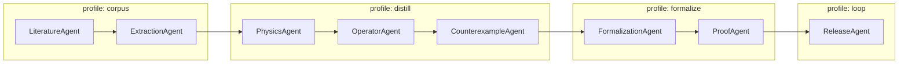

# Architecture

## Strategic position

Open Distillation Factory is intentionally **not** a general-purpose “idea-to-publication AI lab.”

Its wedge is narrower and deeper:

- provenance-first scientific records,
- formal semantics and explicit validity classes,
- reproducible execution traces,
- proof-carrying promotion of scientific claims.

In short: a glass-box distillation factory for MD and interatomic-potential benchmarking.

## Four-layer product architecture

### Layer 1 — Corpus & extraction

Purpose: convert literature and benchmark artifacts into canonical, typed records.

Inputs:
- papers, supplementary tables, benchmark datasets
- simulator outputs and metadata

Outputs:
- structured `PhysicalSystem`, `Model`, `Observable`, and provenance records

Primary concerns:
- schema-normalized extraction
- unit normalization
- citation/provenance completeness

### Layer 2 — Distillation engine

Purpose: discover reusable operator structure in error behavior.

Core tasks:
- error correlation mining
- low-dimensional structure detection
- class-conditioned correction discovery
- counterexample and regime-boundary search

Outputs:
- candidate operators with numerical evidence
- residual/error diagnostics

### Layer 3 — Formal promotion

Purpose: convert candidate insights into typed, checkable scientific assets.

Core tasks:
- formal definitions for observables/operators
- theorem target generation
- proof discharge and status tracking

Outputs:
- promoted `OperatorPack` artifacts with proof obligations/status

### Layer 4 — Internal success loop closure

Purpose: close the loop on transparent workflows and artifacts through reproducible internal run closure.

Surface:
- manifest-first run closure for lineage, datasets, operators, and proofs
- machine-consumable artifacts for internal replay and promotion gates

## Runtime stack responsibilities

### Hermes (orchestration harness)

Hermes runs persistent workflows:
- profile isolation,
- memory and scheduling,
- subagent delegation and messaging,
- sandboxed tool execution,
- plugin/API/MCP integration surfaces.

### Rust (research kernel)

Rust hosts deterministic, typed computation:
- schemas and parsers,
- canonical transforms,
- provenance graph updates,
- controlled recomputation,
- fast search/counterexample engines.

### Python/PsiKit (exploration lab)

Python hosts discovery workflows:
- statistics and dimensionality reduction,
- uncertainty analysis,
- notebook-driven exploration,
- operator candidate generation.

### Lean 4 (certification layer)

Lean hosts semantic contracts:
- formal definitions,
- assumption bundles / validity classes,
- theorem targets,
- machine-checked proof status.

## Canonical entities

- `PhysicalSystem`
- `Model`
- `Observable`
- `DerivedObservable`
- `BenchmarkInstance`
- `ErrorVector`
- `Operator`
- `ValidityClass`
- `OperatorPack`

`OperatorPack` remains the publication/promotion unit and links numerical evidence to formal obligations.

## Hermes profile topology

- `corpus`: ingestion, extraction, parsing, bibliography sync
- `distill`: Rust transforms + Python operator discovery
- `formalize`: theorem generation and Lean proof workflow
- `loop`: reports, artifacts, docs, and run closure

## Promotion ladder

1. Observation (signal only)
2. Candidate (typed operator + evidence)
3. Promoted (validity class + proof obligations)
4. Certified (proof obligations discharged)

A claim can only ascend if provenance, reproducibility, and proof metadata are complete.
