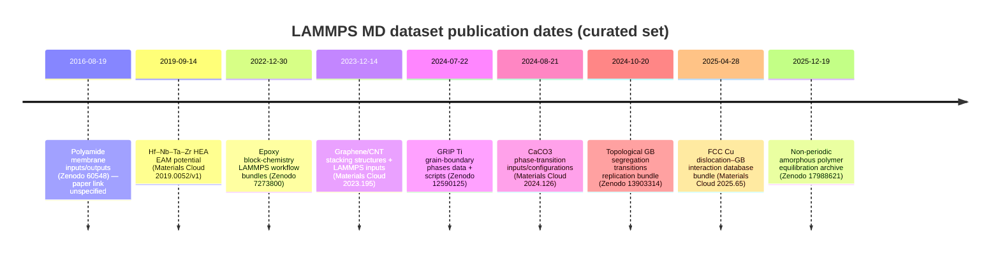

# Curated Library of Downloadable LAMMPS MD Simulation Files for Materials Science Papers

## Executive summary

Open, reusable **LAMMPS-based molecular dynamics (MD) “simulation packages”** (inputs, structures/data files, potentials, and sometimes full output trajectories) are increasingly deposited outside publisher supplements—most commonly on entity["organization","Zenodo","research repository"] and entity["organization","Materials Cloud","materials data platform"], with some paper-linked templates on entity["company","GitHub","code hosting platform"]. The best-curated packages include (i) a citable DOI, (ii) explicit linkage to the peer‑reviewed article, (iii) versioning, and (iv) clear licensing (often CC BY). citeturn15view0turn22view0turn37view0turn38view0

From the prioritized journal set, the strongest “download-and-run” candidates identified here focus on: (a) **interfaces and defects in metals** (grain boundaries and dislocations), including large template archives and databases; (b) **high-entropy/alloy potentials** distributed as LAMMPS‑readable files; (c) **ceramic/mineral phase behavior** with explicit LAMMPS inputs and starting configurations; and (d) **polymer workflows** including LAMMPS inputs, bond/react templates, and packed/assembled structures. citeturn15view0turn18view0turn22view0turn37view0turn38view0

A recurring limitation is that some seemingly relevant repository uploads contain LAMMPS files yet **do not clearly declare the associated paper** (or do not expose machine-readable file trees from certain mirrors). Those are flagged as “paper unspecified” and are **not** included in the main paper-by-paper table unless an explicit article link/DOI is available. citeturn42view0turn41search2turn30view0

## Scope and method

Inclusion criteria for the main table:

Only entries that (1) explicitly state **LAMMPS was used**, (2) have a **high-quality paper** (journal or preprint with DOI) clearly linked to the data/software deposit, and (3) provide **downloadable simulation artifacts** (e.g., LAMMPS input scripts, structures/data files, potentials, templates, restart/trajectory outputs, or bundled archives). citeturn15view0turn18view0turn22view0turn37view0turn38view0

Primary sources were preferred: repository landing pages (for file lists, sizes, licenses, and DOIs) and open full texts when accessible. For “potential-only” packages, inclusion was limited to those that provide a **LAMMPS-readable potential file** and are explicitly tied to a peer‑reviewed materials paper. citeturn22view0turn21search6turn21search7

Complementary note: dedicated potential hubs—e.g., the entity["organization","NIST Interatomic Potentials Repository","materials data repository"] and entity["organization","OpenKIM","interatomic models platform"]—are excellent for **LAMMPS-ready interatomic models**, but they often provide fewer end-to-end “paper reproduction bundles” than Zenodo/Materials Cloud deposits. citeturn21search6turn21search7

## Curated LAMMPS simulation-file sources grouped by material class

The tables below are grouped by **material class** (metals, alloys, ceramics/minerals, polymers, 2D materials). Within each row: “Direct links” prioritize DOI landing pages plus file-level downloads when the host exposes stable file URLs.

image_group{"layout":"carousel","aspect_ratio":"16:9","query":["Materials Cloud archive dislocation grain boundary interaction dataset FCC Cu files","Zenodo record data for grand canonically optimized grain boundary phases titanium files list","Zenodo data for topological grain boundary segregation transitions files list","GitHub lammps nanocutting SiC tool template repository file tree"],"num_per_query":1}

### Metals

| Paper (citation) | DOI / paper link | Simulation purpose & novelty (2–3 sentences) | Direct links to simulation files | File types & sizes (as listed) | License | Host |
|---|---|---|---|---|---|---|
| **entity["people","Khanh Dang","materials researcher"] et al.**, 2025, **entity["organization","Scientific Data","nature journal"]** | Paper DOI: 10.1038/s41597-025-05256-6 citeturn17view0 | A large, systematically generated MD dataset of **dislocation–grain-boundary interactions in FCC Cu**, spanning hundreds of symmetric tilt GBs and multiple dislocation character types and driving stresses. Novelty is the inclusion of both minimum-energy and many metastable GB structures, enabling statistics and ML-ready analyses beyond equilibrium GB catalogs. citeturn16view0turn15view0 | Dataset record: https://archive.materialscloud.org/records/59y2w-rap91 citeturn15view0 | `DisGB_data.zip` (6.6 GiB); `README.txt` (1.4 KiB); `files_description.md` citeturn15view0 | CC BY 4.0 citeturn15view0 | Materials Cloud |
| **entity["people","Enze Chen","materials scientist"] et al.**, 2024, **entity["organization","Nature Communications","journal"]** | Paper DOI: 10.1038/s41467-024-51330-9 citeturn36search2 | Introduces **GRIP**, an automated grand-canonical optimization workflow for grain-boundary phases, and demonstrates it on **hcp Ti tilt grain boundaries**, discovering new structures and phase transitions. The paper emphasizes coupling between point-defect absorption and changes in the GB dislocation-network topology—important for irradiation-related defect accommodation. citeturn36search2turn37view0 | Zenodo dataset DOI: 10.5281/zenodo.12590125 (file list below) citeturn37view0; GitHub: https://github.com/enze-chen/grip citeturn37view0 | Multiple `.zip` bundles: GB structures + scripts (`0001_*`, `01-10_*`, `12-10_*`), plus `GRIP_snapshot.zip` (1.0 MB), `scripts.zip` (8.8 kB), `gamma_surface.zip` (3.5 kB). Individual sizes range 3.5 kB–148.2 MB; total listed 431.6 MB. citeturn37view0 | CC BY 4.0 citeturn37view0 | Zenodo + GitHub |
| **entity["people","Geraldine Anis","researcher"] et al.**, 2024, **entity["organization","Physical Review Materials","aps journal"]** | Paper DOI: 10.1103/PhysRevMaterials.8.123604 citeturn25search6 | Uses LAMMPS MD trajectories of an **edge dislocation in FCC Ni** under shear to fit a reduced equation-of-motion model via DE‑MC, producing parameter distributions (drag, effective mass, force) with uncertainty quantification. Novelty is the Bayesian parameterization workflow that converts atomistic dislocation trajectories into a mobility-law style surrogate with uncertainties. citeturn25search6turn30view0 | Dataset DOI (Zenodo): 10.5281/zenodo.10649697 (also referenced via 10.5281/zenodo.14222962 in aggregated metadata) citeturn30view0turn25search6 | Reported file components include `data.zip` and `data_stress.zip` (LAMMPS scripts, logs, OVITO/DXA outputs), plus the Mishin 2004 EAM file `NiAl_Mishin_2004.eam.alloy`; sizes not available from the accessible metadata snapshot. citeturn30view0 | CC BY (as listed in aggregated metadata); exact Zenodo record license field not retrievable here → **unspecified** in this report. citeturn30view0 | Zenodo (record access via DOI) |

### Alloys

| Paper (citation) | DOI / paper link | Simulation purpose & novelty (2–3 sentences) | Direct links to simulation files | File types & sizes (as listed) | License | Host |
|---|---|---|---|---|---|---|
| **entity["people","Soumyadipta Maiti","materials researcher"] & Walter Steurer**, 2016, **Acta Materialia** | Paper DOI: 10.1016/j.actamat.2016.01.018 citeturn22view0 | Provides a **LAMMPS-readable EAM potential** for Hf–Nb–Ta–Zr refractory HEAs, used to model lattice distortions and short-range order effects in the alloy after high‑temperature annealing. Novelty is packaging a reusable EAM file aligned to the paper’s calibration methodology and parameter choices for this HEA family. citeturn22view0 | Materials Cloud dataset (DOI on page): https://archive.materialscloud.org/records/a2hfp-zcx33 citeturn22view0 | `Hf-Nb-Ta-Zr_EAM_potential.zip` (568.2 KiB) + README; total 569.6 KiB. citeturn22view0 | CC BY 4.0 citeturn22view0 | Materials Cloud |
| **entity["people","Vivek Devulapalli","materials researcher"] et al.**, 2024, **entity["organization","Science","aaas journal"]** | Paper DOI: 10.1126/science.adq4147 citeturn38view0 | Combines experimental microscopy data with MD/MC simulations to demonstrate **topological grain-boundary segregation transitions**, with simulation tooling packaged (including GRIP-related components) for reproducibility. The deposit includes semi‑grand‑canonical MD/MC workflows and supporting scripts for extracting thermodynamic excess properties. citeturn38view0 | Zenodo dataset DOI: 10.5281/zenodo.13903314 citeturn38view0 | `MDMC-SGC.zip` (6.1 GB), `Data.zip` (1.6 GB), `GRIP.zip` (1.0 MB); total listed 7.7 GB. citeturn38view0 | CC BY 4.0 citeturn38view0 | Zenodo |

### Ceramics and minerals

| Paper (citation) | DOI / paper link | Simulation purpose & novelty (2–3 sentences) | Direct links to simulation files | File types & sizes (as listed) | License | Host |
|---|---|---|---|---|---|---|
| **entity["people","Elizaveta Sidler","researcher"] & Raffaela Cabriolu**, 2024, arXiv preprint | Preprint DOI: 10.48550/arXiv.2408.04036 citeturn18view0 | Uses MD (Raiteri potential) to map selected **CaCO₃ structural phase transitions** across wide temperature and pressure ranges, classifying transitions via free‑energy analysis and identifying continuous vs first‑order behavior for specific transformations. Novelty is providing compact, example-ready LAMMPS + PLUMED inputs and equilibrated configurations for multiple phases and system sizes. citeturn18view0 | Materials Cloud dataset DOI on page: https://archive.materialscloud.org/records/36xwe-mfe60 citeturn18view0 | LAMMPS inputs (`in_temp.lammps`, `in_press.lammps`, ~3.1 kB each), multiple `.data` starting configurations (~0.55–2.5 MiB each), plus `plumed_*.dat`, `index.ndx`, README; total 11.8 MiB. citeturn18view0 | CC BY 4.0 citeturn18view0 | Materials Cloud |
| **entity["people","K.Y. Fung","researcher"] et al.**, 2017, **entity["organization","Computational Materials Science","journal"]** | Paper DOI: 10.1016/j.commatsci.2017.03.006 citeturn41search0 | MD study of how **surface flaws on diamond cutting tools** accelerate wear during nanometric cutting, identifying flaw-size-dominated wear responses and atomistic detachment mechanisms. Novelty is an MD-driven statistical characterization of flaw-induced wear and force-signal changes, tied to a reusable LAMMPS cutting template. citeturn41search0turn11search3 | GitHub template repository (paper-linked): https://github.com/polyu-kyfung/lammps-nanocutting-SiC---tool-r15c10-template citeturn11search3 | Repository provides LAMMPS input templates + associated model files (types inferred from repository topic and description); file sizes and explicit license not specified in accessible summary. citeturn11search3 | **Unspecified** (repository license not confirmed here). citeturn11search3 | GitHub |

### Polymers

| Paper (citation) | DOI / paper link | Simulation purpose & novelty (2–3 sentences) | Direct links to simulation files | File types & sizes (as listed) | License | Host |
|---|---|---|---|---|---|---|
| **entity["people","M. Livraghi","researcher"] et al.**, 2023, Journal of Physical Chemistry B (paper identified on dataset record) | Paper DOI: 10.1021/acs.jpcb.3c04724 citeturn10search17 | Provides an end-to-end, reproducible dataset for **crosslinked epoxy resin modeling**, including LAMMPS scripts for minimization/equilibration, curing (bond/react compatible), glass-transition annealing, and tensile tests. Novelty is the “block chemistry” workflow packaging—force-field artifacts and pre/post-reaction templates—so curing and property pipelines can be reproduced. citeturn10search17 | Zenodo record: https://zenodo.org/records/7273800 citeturn10search17 | Zipped bundles: `lammps.zip` (45.5 MB, scripts + data), `lammps_noCharge.zip` (13.7 MB), plus supporting chemistry and Amber libraries; total files listed include `amberLib.zip`, `curingReaction.zip`, `README.md`. citeturn10search17 | **Unspecified** on the accessible record snippet for this version (an earlier Zenodo version lists CC BY 4.0). citeturn10search18turn10search17 | Zenodo |
| **entity["people","F. Weber","researcher"] et al.**, 2023, Forces in Mechanics | Cited on dataset record as: “On equilibrating non-periodic molecular dynamics samples…” (Forces in Mechanics 2023) citeturn10search3 | Deposits a large set of outputs (and associated simulation metadata) for **equilibrating non-periodic amorphous polymer samples**, targeted at coupled particle–continuum workflows. Novelty is providing a full, large-scale archive (GB-scale) structured by observable categories (strain/stress/temperature) and simulation meta info alongside logs. citeturn10search3 | Zenodo record: https://zenodo.org/records/17988621 citeturn10search3 | `Zenodo.zip` (5.1 GB) + `readme.txt` (7.9 kB); within the archive: multiple per-run folders with `log` and `meta.info` plus derived result files. citeturn10search3 | **Unspecified** (license field not captured in the accessible snippet). citeturn10search3 | Zenodo |

### 2D materials

| Paper (citation) | DOI / paper link | Simulation purpose & novelty (2–3 sentences) | Direct links to simulation files | File types & sizes (as listed) | License | Host |
|---|---|---|---|---|---|---|
| **entity["people","Mingda Ding","researcher"] et al.**, 2023, Journal of Physical Chemistry C | Paper DOI: 10.1021/acs.jpcc.3c06132 citeturn20view0 | MD study of **multilayer graphene with inserted CNT nanospacers**, aimed at reducing interlayer interactions and rationalizing experimentally observed changes (e.g., via Raman). Novelty is the release of multiple stacking-structure families plus LAMMPS input scripts for configuration relaxation and per-frame energy evaluation, enabling parameterized replication of spacing/arrangement effects. citeturn20view0 | Materials Cloud dataset: https://archive.materialscloud.org/records/rqp47-8es22 citeturn20view0 | Zipped structure libraries (`CNT_PBD_2tubes.zip` 52.5 MiB; `CNT_PBD_3tubes.zip` 3.2 MiB; `CrossCNT.zip` 6.6 MiB), LAMMPS inputs (`in.*.in`), and a MATLAB utility (`dump2data.m`); total 62.3 MiB. citeturn20view0 | CC BY‑NC‑SA 4.0 citeturn20view0 | Materials Cloud |

## Observations and reuse recommendations

Across the strongest entries, three packaging patterns dominate.

First, **“template + structures” bundles**: a small set of input scripts paired with many starting configurations (e.g., `.data`, POSCAR-derived outputs) that allow you to sweep defect geometries, boundary types, or loading conditions. The Cu dislocation–GB database and the CaCO₃ transition inputs exemplify this high reusability per byte: minimal scripting overhead with many prebuilt atomic models. citeturn15view0turn18view0

Second, **“workflow archives”**: repositories that include not just LAMMPS inputs but also construction tools (e.g., mapping/topology templates), analysis scripts/notebooks, and snapshots/outputs. The Science “topological segregation transitions” deposit explicitly mixes experimental data, MD/MC simulation tooling, and analysis code; the epoxy dataset packages bond/react templates and multiple property workflows (curing, Tg, deformation). citeturn38view0turn10search17

Third, **“potential-centric releases”**: standalone LAMMPS-readable potentials (EAM/MEAM/etc.) that directly support a paper’s results and can be dropped into new studies. The Hf–Nb–Ta–Zr HEA EAM potential illustrates this; similar artifacts also appear in curated potential registries like NIST IPR and OpenKIM (often with test inputs rather than full paper pipelines). citeturn22view0turn21search6turn21search7

Two practical checks materially improve reuse success when you download a “paper package”:

1) confirm the archive includes **the exact potential file** used (or a resolvable DOI to it) and any required LAMMPS packages/styles implied by the scripts; 2) check whether the deposit includes **final/equilibrated configurations** (vs only generators), which is often the difference between “minutes to reproduce” and “days to reproduce.” citeturn37view0turn15view0turn10search17

Finally, some high-value repositories contain LAMMPS inputs but **lack an explicit linked paper DOI** (or the paper link is not exposed in accessible metadata). Examples include the stand-alone polyamide membrane bundles and some single-file input/model uploads; these are useful, but they were excluded from the main table because they do not satisfy the “paper citation + DOI for each entry” requirement without additional manual provenance work. citeturn42view0turn41search2

## Mermaid timeline of dataset publication dates

Dates below are taken from the “Published” fields on the repository landing pages for: Materials Cloud (2019–2025) and Zenodo (2016–2025) entries included above. citeturn22view0turn20view0turn18view0turn37view0turn38view0turn15view0turn42view0turn10search17turn10search3

