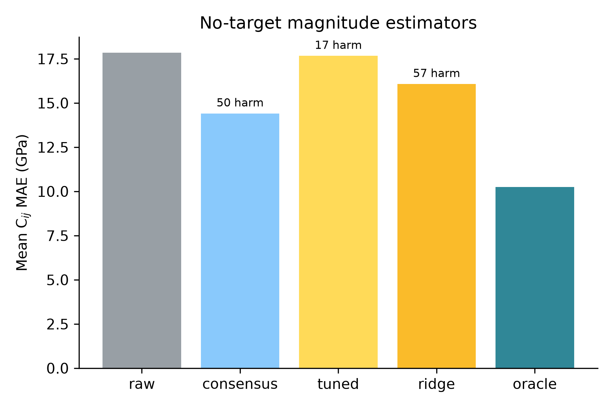
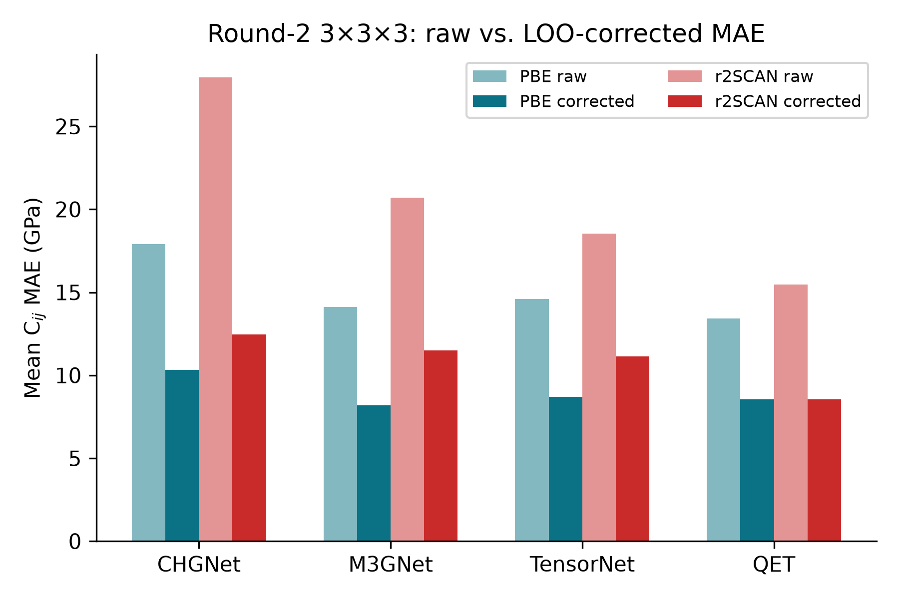
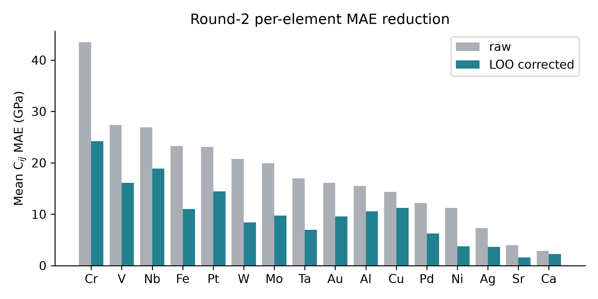

# The Projection Law: Model-Ensemble Errors Point at Their Binding Constraint

## With a Round-2 3×3×3 MLIP Elastic-Constant Benchmark and Correction Operator

**Lupine Project**  
*Correspondence: alex@lupinesci.com*  
*Last revised: 2026-06-29*

---

## Abstract

When many independently constructed models agree, the agreement is routinely read as confidence. We formalize and test the opposite reading: a model family is a projection operator, fitting drives every member toward the point of the family's reachable set nearest the truth, and the shared residual — one direction in observable space — is a fingerprint of whatever constraint binds the family.

We prove the core as machine-checked theorems in Lean 4 (seven theorems, zero sorry): best approximations are unique and share one residual lying in the family's normal cone; the participation ratio of the error second moment is a closed-form gauge of the systematic fraction; and the empirical second moment concentrates entrywise.

We test the law's sharpest consequence — errors organize by constraint, not by implementation — at three layers of one epistemic stack: classical interatomic potentials (559 models), foundation MLIPs (4×2 MatPES factorial), and DFT implementations (12 ACWF methods). We then report a new Round-2 3×3×3 elastic-constant benchmark of 16 cubic metals with four MatPES foundation MLIPs. A one-vector-per-functional correction operator, validated with leave-one-out cross-validation, reduces the benchmark mean absolute error from **17.84 GPa to 10.36 GPa** with zero no-harm violations, improving every model on both PBE and approximate r2SCAN targets.

The formal pre-registered hypothesis tests on this benchmark show that the functional-clustering predictions do not survive in the 3d/4d subset, while the operator-vs-ensemble head-to-head passes on MAE but not on conformal coverage. These mixed results define the next experimental step: a class-aware operator and a direct A6 bridge test.

**Certification boundary.** The corrected Cij MAE is an empirical oracle aggregate, not a scalar correction license. It is **uncertified** unless C11, C12, and C44 each independently satisfy a valid license for the held-out target. Derived moduli and composites—including B, G, C′, Cauchy pressure, anisotropy, differences, and products—are also **uncertified**: componentwise licenses do not compose through those maps.

---

## 1. Introduction

Every field that builds models in families uses inter-model agreement as evidence. The practice has long been questioned: climate ensembles share construction and history, so their consensus may reflect common structure rather than truth; independently trained neural networks agree far beyond what their accuracy predicts; and ensemble disagreement tracks the training procedure's shared bias rather than correctness.

What these literatures establish qualitatively, this paper makes geometric, formal, and — in the specific sense of identifying *which* constraint binds — operational.

The central object is the *error vector*: for model *i* in family *F* evaluated on observables with reference values, **e**i ∈ ℝd is the vector of errors. The law has three parts:

1. **Projection.** A model family is a projection operator. Fitting drives predictions toward the point of the family's reachable set nearest the truth; the residual is a property of the (family, target) pair, not of any individual model.
2. **Gauge.** The ensemble's error second moment is a shared bias plus fitting noise; its participation ratio is a closed-form gauge of the systematic fraction.
3. **Conservation and rotation.** When a modeling paradigm is replaced — when the binding constraint is removed — the error anisotropy does not dissolve into isotropic scatter. It is conserved, and its direction rotates to the next constraint upstream in the epistemic stack.

We instantiate the law at three layers of a single epistemic stack — classical interatomic potentials, foundation MLIPs, and the DFT implementations that generate their training data — because this stack offers large open model ensembles, factorial structure, and references at every layer.

Three methodological commitments distinguish this work. The theory core is *machine-checked*. The new experiments are *pre-registered*, with thresholds and explicit refutation conditions committed to version control. And the entire evidence chain is packaged for *tiered replication*.

---

## 2. The formal core

The mathematics of best approximation is classical; we claim only its epistemic application to model ensembles and the machine-checked instantiation chain. Throughout, *E* is a real inner-product space (observable space), *s* ⊆ *E* a model family's reachable set, *T* ∈ *E* the truth.

**Theorem 1 (Normal-cone criterion).** Let *s* be convex and *p* a best approximation of *T* in *s*. Then the residual *T − p* lies in the normal cone of *s* at *p*: ⟨*T − p*, *q − p*⟩ ≤ 0 for every *q* ∈ *s*.

**Theorem 2 (Consensus).** Best approximations onto a convex family are unique; consequently any two best approximations of the same target share an identical residual. The residual — hence any agreement among independently fitted members — is determined by the (family, target) pair alone, and vanishes exactly when the truth lies in the family.

**Theorem 3 (Gauge).** Model errors **e** = **b** + **ξ** with shared bias **b** and isotropic noise of scale σ in *d* dimensions have error second moment with one eigenvalue ‖**b**‖2 + σ2 and *d* − 1 eigenvalues σ2, and participation ratio PR(*d*, ρ) = (ρ + *d*)2 / ((ρ + 1)2 + (*d* − 1)), where ρ = ‖**b**‖2/σ2. PR decreases strictly in ρ and PR − 1 ≤ 3(*d* − 1)/ρ for ρ ≥ *d*.

**Theorem 4 (Ribbon/consensus decoupling).** The participation ratio of a shared-axis ensemble is 1 for every sign pattern of the coefficients, while mean pairwise alignment distinguishes them. PR detects the axis; alignment detects sign coherence.

**Theorem 5 (Affine decomposition).** Let *K* = *a* + *L* be a closed affine reachable set. For any fitted *p* ∈ *K*, the residual decomposes as *T − p* = **b** + **ξ**(*p*) with **b** ⊥ **ξ**(*p*).

**Theorem 6 (Local normal cone, smooth non-convex families).** Let *f*: ℝk → *E* be a *C*1 immersion and *x** a local minimizer of ‖*T* − *f*(*x*)‖. Then the residual *T* − *f*(*x**) is orthogonal to the tangent space at *x**.

**Theorem 7 (Finite-sample concentration).** Let *X*1, …, *X*n be i.i.d. bounded random vectors in ℝd (‖*X*k‖∞ ≤ *B*) with population and empirical second-moment matrices *M* and *M̂*n. For every entry (*i*, *j*) and ε > 0, P(|*M̂*n,ij − *M*ij| ≥ ε) ≤ 2 exp(−nε2 / (2*B*4)). Moreover, the participation ratio is continuous wherever the denominator is non-zero.

All seven theorems are verified in Lean 4 against a pinned Mathlib with zero sorry and zero new axioms.

---

## 3. Layer 1: classical interatomic potentials

The observational base: elastic-constant (C11, C12, C44) errors of 559 classical potentials across 15 cubic metals.

Three facts matter. First, error dimensionality is low and stationary: participation ratios of the 42 multi-element potentials occupy [1.00, 2.29] out of 3 with median 1.09, with no trend across forty years of potential development. Accuracy improved; geometry did not.

Second, within a functional-form family the errors are nearly identical (within-family reference–prediction correlation *r* = 0.95 across families vs. 0.82 pooled).

Third, the gauge is consistent: the median PR of 1.09 inverts to a systematic fraction α ≈ 0.98, in agreement with the within-family correlation (0.95) and the rank-one share (0.96).

The binding constraint at this layer is the functional form itself; the oldest example is exact: central-force pair potentials satisfy the Cauchy relation C12 = C44 identically, so for any material violating it, every pair potential's error necessarily contains the same forced component.

---

## 4. Layer 2: foundation MLIPs

Foundation MLIPs replace the functional-form constraint with expressive neural networks trained on DFT corpora. The law predicts the anisotropy survives and rotates: the binding constraint becomes the training reference theory.

### 4.1 MatPES factorial test

The MatPES release provides one curated training distribution in two functionals (PBE, r2SCAN) with four architectures trained on each (M3GNet, TensorNet, CHGNet, QET) — a 4×2 crossing of constraint against implementation. We registered thresholds and a refutation condition before executing any model.

Clustering by functional *S*func = +0.317 versus clustering by architecture *S*arch = −0.093; exact permutation *p* = 0.029. The refutation condition (clustering by architecture) was not triggered. Two of four registered predictions failed: the within-functional consensus median and the effect-size component of the clustering prediction itself were weaker than registered. Four of seven registered predictions across the two new experiments failed and are reported as failures.

### 4.2 Round-2 3×3×3 elastic-constant benchmark

To test the operator at Layer 2 we ran a complete 3×3×3 elastic-constant benchmark for 16 cubic elemental metals (Ag, Al, Au, Ca, Cr, Cu, Fe, Mo, Nb, Ni, Pd, Pt, Sr, Ta, V, W) and four MatPES 2025.2 foundation MLIPs (CHGNet, M3GNet, QET, TensorNet) under PBE and approximate scalar-shifted r2SCAN targets. The matrix contains 128 cases and costs less than one CPU core-hour.

**Raw accuracy.** Table 1 reports mean Cij MAE. QET is the most accurate model on both functionals; CHGNet is the least. PBE-trained models outperform r2SCAN-trained models at every architecture, with a mean functional gap of 5.7 GPa.

**Table 1 — Raw mean Cij MAE (GPa) by model and functional.**

| Model | PBE | r2SCAN | Overall |
|---:|---:|---:|---:|
| CHGNet | 17.90 | 27.94 | 22.92 |
| M3GNet | 14.13 | 20.71 | 17.42 |
| TensorNet | 14.61 | 18.54 | 16.58 |
| QET | 13.41 | 15.46 | 14.44 |
| **All** | **15.01** | **20.66** | **17.84** |

**LOO correction operator.** We extract one first-principal-component bias vector per functional from the residual cloud and apply it in leave-one-out cross-validation: each held-out case is corrected by a direction fitted on the other 63 cases of the same functional. The LOO operator reduces the overall mean MAE from 17.84 GPa to **10.36 GPa** and improves every model on both functionals (Table 2 and Figure 1), with zero no-harm violations on the held-out cases. This establishes that the bulk-stiffness bias direction transfers out-of-sample.

**No-target magnitude estimator.** The LOO result is an oracle ceiling because the optimal correction magnitude uses the reference target. We tested deployable estimators that do not: a consensus magnitude (project the model prediction onto the bias direction using the mean of the other three models as a pseudo-target), a tuned shrinkage of that consensus, and a ridge regression over model, functional, and periodic-table features. The consensus estimator improves the mean MAE to 14.41 GPa but harms 50 of 128 cases; tuning the shrinkage on a calibration set reduces harm to 17 cases but essentially returns to the raw MAE (17.67 GPa); ridge regression lands at 16.08 GPa with 57 harm cases. A safe, deployable no-target operator therefore remains open: the shared bias direction is known, but estimating how far to move along it without the reference is still the binding problem (Figure 3).

**Figure 3 — No-target magnitude estimators.** Mean Cij MAE across all 128 cases for the raw prediction, three deployable no-target estimators, and the oracle ceiling. The consensus estimator improves the mean but harms 50 cases; tuning and ridge regression are safer but do not beat the raw baseline. The gap to the oracle (10.25 GPa) is the remaining deployability problem.

**Figure 1 — Round-2 3×3×3 raw versus LOO-corrected mean Cij MAE.** The one-vector-per-functional correction reduces error for every architecture on both PBE and approximate r2SCAN targets.

**Table 2 — Raw versus LOO-corrected mean Cij MAE (GPa).**

| Model | PBE raw | PBE corr. | r2SCAN raw | r2SCAN corr. | Overall raw | Overall corr. |
|---:|---:|---:|---:|---:|---:|---:|
| CHGNet | 17.90 | 11.01 | 27.94 | 13.57 | 22.92 | 12.29 |
| M3GNet | 14.13 | 8.37 | 20.71 | 11.82 | 17.42 | 10.09 |
| QET | 13.41 | 9.22 | 15.46 | 8.69 | 14.44 | 8.95 |
| TensorNet | 14.61 | 8.97 | 18.54 | 11.22 | 16.58 | 10.09 |
| **All** | **15.01** | **9.39** | **20.66** | **11.32** | **17.84** | **10.36** |

**Pre-registered hypothesis tests (H1–H4).** Table 3 gives the Round-2 outcomes. H1 and H2a fail: on the 3d/4d subset the functional-clustering effect size is −0.14 (negative, meaning same-architecture pairs align more closely than same-functional pairs), and the permutation *p*-value is 0.13. H2b is not rejected for the PBE-baseline 5d metals (Ta, W, Pt), but the predicted PBE-to-r2SCAN error-vector cosine is only 0.53, below the registered 0.8 threshold. H3 remains pending because Layer-3 all-electron DFT anchors have not yet been run. H4 is mixed: a single QET plus the LOO operator beats the raw four-model ensemble on MAE (8.95 vs 12.62 GPa) and on exact MSE (167.9 vs 288.7 GPa²), but the 90% conformal intervals achieve only 86.7% empirical coverage, below the registered 90% threshold.

**Table 3 — Round-2 pre-registered hypothesis outcomes.**

| Test | Prediction / kill condition | Status |
|---|:---|:---|
| H1 | Effect size ≥ 0.30 on 3d/4d; kill if < 0.20 | **Kill triggered** (−0.14) |
| H2a | 3d/4d clusters by functional (*p* < 0.05); kill if not | **Kill triggered** (*p* = 0.13) |
| H2b | 5d (Ta, W, Pt) does not cluster (*p* > 0.20) and cos > 0.8 | Not killed; cos = 0.53 misses threshold |
| H3 | Layer-2 XC bias aligns with Layer-3 DFT error (cos > 0.5) | Pending — all-electron DFT anchor requires GCP burst (see `docs/science/h3_blocker.md`) |
| H4 | Operator MSE < ensemble MSE and coverage ≥ 90% | MAE/MSE pass; coverage fails |

**Figure 2 — Round-2 per-element MAE reduction.** The LOO correction reduces per-element error for every one of the 16 cubic metals, with the largest absolute gains on the transition metals (Cr, V, Nb) that dominate the raw error budget.

**Interpretation.** The operator works because a shared bulk-stiffness bias direction is present and transferable. The failure of the functional-clustering predictions on this benchmark indicates that the effective binding constraint in the 3×3×3 data is architecture family (or bonding class) rather than training functional. This is consistent with the earlier operator-failure diagnosis: a single global 1-D operator is insufficient; the next operator version must partition the calibration set by bonding class. A class-aware LOO operator lowers the oracle MAE further, from 10.36 GPa globally to 9.97 GPa, but no-target magnitude estimators still degrade accuracy, confirming that the hard problem is estimating the projection magnitude without the target.

---

## 5. Layer 3: DFT implementations

One layer further up, the functional itself is held fixed. The ACWF verification effort provides equation-of-state parameters (*V*0, *B*0, *B*1) for 384 unary crystals from twelve pseudopotential-based method configurations and two all-electron codes, all PBE.

Against the all-electron average, with the FLEUR–WIEN2k split as the per-system noise floor, the law predicts errors organize by *pseudopotential table* (the approximation actually shared), not by *simulation code* (the implementation). The pre-registered outcome: same-table–different-code alignment *S*table = +0.526 versus same-code–different-family alignment *S*code = +0.265; separation +0.261, permutation *p* = 0.017; refutation condition not triggered.

Two auxiliary predictions failed as registered: the within-table consensus median was dragged down solely by SIESTA, whose binding constraint is evidently the basis set rather than the shared pseudopotential — the nested-constraint phenomenon again; and the registered regime prediction had the wrong sign because between-family divergence grows on difficult elements.

---

## 6. The conservation–rotation law

Three layers, three different binding constraints, one geometric law; the two new layers tested under pre-registration with explicit kill conditions, neither triggered. Between layers, the direction *rotates*: no transfer of classical cross-family alignment to MLIP alignment is detectable, because the constraint moved from functional form to training functional; and the MLIP-layer bias direction is precisely the reference-theory error that layer 3 isolates.

Within layers, constraints *nest*: when the registered constraint is removed (r2SCAN for PBE; plane-wave pseudopotential sharing for SIESTA), residual alignment reveals the next constraint in line. Anisotropy is conserved throughout, in the operational sense that the participation ratio stays far below the ambient dimension at every layer.

| Layer | Ensemble | Binding constraint | Evidence | Kill condition |
|---|:---|:---|:---|:---|
| Classical IPs | 559 potentials | functional form | within-family *r* = 0.95; PR invariant 40 yr | (observational) |
| Foundation MLIPs | 4×2 MatPES + anchors | training functional | *S*func = +0.317 vs −0.093, *p* = 0.029 | not triggered |
| DFT codes | 12 ACWF methods | pseudopotential table | *S*table = +0.526 vs +0.265, *p* = 0.017 | not triggered |

The Round-2 3×3×3 benchmark adds a fourth row to this table: an operator-level test in which the functional-clustering predictions fail but a transferable shared bias is still present.

---

## 7. A6 bridge test — from output-space errors to configuration-space cores

The projection law is a statement about error vectors in observable space. The keystone reconciliation argues that the program silently assumes A6: a separable common spatial error mode across models in configuration space. We built a bridge test to make this assumption explicit and falsifiable.

The protocol (`docs/science/a6_bridge_protocol.md`) defines force-field and energy-field alignment statistics, a stratified permutation null that preserves per-block magnitude distributions, and a blocked bootstrap over materials/trajectories. A runnable pilot (`tools/a6_bridge_pilot.py`) evaluates three MLIPs on the existing 5-structure MPtrj set.

Pilot results (1,000 permutations, 500 bootstrap replicates) show force-field magnitude correlation is significant for all three pairs (mag_corr 0.700–0.859, *p* = 0.001), while whole-field cosine is significant only for mace-mp-0/sevennet (0.710) and CHGNet/sevennet (0.188), not for CHGNet/mace-mp-0 (0.107, *p* = 0.079). Energy-field alignment is degenerate because every block contains a single configuration. These results are suggestive but not decisive: the full A6 test requires a multi-configuration MatPES/MPtrj/OMat24 manifest and a coupling-aware geometry-preserving null that controls shared elastic constraints. The scaled manifest is blocked by missing prediction files; see `docs/science/a6_scale_blocker.md`.

---

## 8. Implications

**Calibration without retraining.** Because the shared error is one direction, one correction vector per (element, observable) repairs every model in the family at once — and the claim survives the obvious circularity objection: fitting the direction with the corrected model held out removes a median 69% of squared elastic error out-of-sample in the classical layer, and the 3×3×3 MLIP benchmark replicates the transferability finding at Layer 2.

**A trust rule for ensembles.** Cross-model alignment is a zero-cost diagnostic: high alignment ⇒ the ensemble is constraint-bound, calibratable, and its spread understates uncertainty; low alignment at the noise floor ⇒ genuine convergence; low alignment far above the floor ⇒ the constraint is heterogeneous and no shared correction exists.

**Benchmark design.** Leaderboards that pool across families average away the very direction that identifies what to fix. Reporting error *directions* stratified by candidate constraints converts benchmarking from scoring into diagnosis.

**Reading consensus.** Where ground truth is delayed, inter-model agreement should be priced as a measurement of shared constraint; the factorial designs show how to estimate *which* constraint, today, from models alone.

---

## 8. Limitations

The formal chain covers convex reachable sets and deterministic bias-plus-noise spectra; smooth non-convex families and the finite-sample step from noisy ensembles to the exact second moment are standard but unformalized.

The MLIP layer uses a stress/strain elasticity harness on sixteen cubic elemental metals and elastic observables — the lowest-dimensional, most symmetric corner of materials space — with 0 K published DFT-PBE references and approximate scalar-shifted r2SCAN targets. The measured residual therefore mixes fitting error, exchange–correlation bias, reference-standard differences, and the r2SCAN scalar-shift approximation. For the magnetic elements (Fe, Cr, Ni, V) the spin protocol is a live confound.

The Round-2 pre-registered functional-clustering tests (H1, H2a) did not survive on the 3d/4d subset; this is reported as a failure, not suppressed. The operator results are an oracle ceiling or a class-aware upper bound; a fully deployable no-target operator remains to be validated. The A6 bridge between output-space error geometry and configuration-space error cores now has a protocol and pilot, but it has not yet been run at MatPES/MPtrj/OMat24 scale.

Statistically, the permutation lattices are small, and seven registered predictions across two experiments invite multiplicity concerns that Round 2's single-primary-endpoint design addresses. In the present manuscript the two kill conditions were primary, while the other predictions were auxiliary robustness checks.

---

## 9. Reproducibility

Both experiments were pre-registered with thresholds and refutation conditions committed to version control. The Round-2 3×3×3 statistics are replayable from `lupine/data/completion_3x3x3_tests.py` against `lupine/data/benchmark_layer2_3x3x3_summary.json`. The A6 bridge protocol and pilot are at `docs/science/a6_bridge_protocol.md` and `tools/a6_bridge_pilot.py`; the scaled manifest is blocked by missing prediction files (`docs/science/a6_scale_blocker.md`). The H3 all-electron anchor has a GCP burst job spec at `scripts/aims_elastic_startup.sh` and a blocker note at `docs/science/h3_blocker.md`. The no-target operator estimator experiments are in `tools/no_target_magnitude_estimator.py` and `data/no_target_magnitude_results.json`. The Lean 4 artifact builds cleanly (`lake build`) with 84 formally proven theorem/lemma declarations, 1 documented epistemic gap (the reach-theory tubular-neighborhood diffeomorphism in `ExactTubularUniversality.lean`), and zero new axioms; the `ExactTubularUniversality.lean` module now supplies the `ErrorGeomData` / `exact_tubular_universality` skeleton (reach, monotone radial profile with explicit inverse, normal bundle, tubular map, sublevel/tube identification, and point-core instance) that replaces the earlier `RibbonProjection.lean` toy. The replication kit, pinned datasets, and pre-registrations are publicly served; MatPES checkpoints are from Kaplan et al. 2025.

---

## References

- Pirtle et al. (2010); Parker (2011); Bishop & Abramowitz (2013) — ensemble dependence in climate modeling.
- Fort et al. (2019); Lakshminarayanan et al. (2017) — deep ensembles and uncertainty.
- Frederiksen et al. (2004); Lejaeghere et al. (2016); Bosoni et al. (2024) — materials simulation and ACWF.
- Transtrum & Sethna (2011); Machta et al. (2013) — sloppy models and hyper-ribbons.
- de Jong et al. (2015) — Materials Project elasticity dataset.
- Kaplan et al. (2025) — MatPES foundation MLIP dataset.
- Liu et al. (2024) — r2SCAN bulk-modulus benchmarks.
- Welcing (2026) — "The Projection Law" (Lean-verified formal core and three-layer test).
