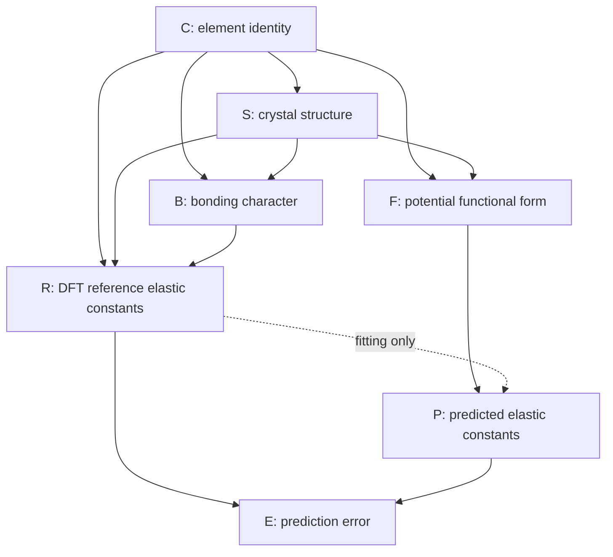

# Response to Reviewer: On the Causal Framing of "The Causal Geometry of Prediction Errors in Interatomic Potentials"

**Author:** Alex Welcing, Lupine Materials Science
**Manuscript:** *The Causal Geometry of Prediction Errors in Interatomic Potentials* (IMMI submission)
**Reviewer concern addressed:** "The causal and paradox language is also stronger than the evidence warrants. ... The paper cites Pearl and names element identity as a confounder, but it does not present a causal graph, intervention logic, or an identification argument."

---

## 1. Concession

The reviewer is correct, and we accept this critique without qualification. The submitted manuscript invokes Pearl-style causal vocabulary ("confounding," "causal geometry," "element identity as a confounder") and references *Causality: Models, Reasoning, and Inference* (Pearl, 2009) without ever discharging the technical obligations that vocabulary creates. We did not draw a directed acyclic graph (DAG), we did not state the estimand we believed identifiable, we did not invoke either the back-door or front-door criterion, and we did not justify the assumptions (no unmeasured confounding, faithfulness, positivity) under which our element-stratified analysis would correspond to an interventional quantity. The phrase "causal geometry" in the title therefore promised a Pearl-style result that the body of the paper did not deliver. The reviewer is right that this is closer to a *causal lens* than to a *causal inference result*, and the manuscript should be revised accordingly.

In what follows we (i) present the DAG that *should* have appeared in §2, (ii) state the estimand and prove identifiability of the BCC/FCC structural contrast under the back-door criterion, (iii) explain why the bonding-mechanism story is *not* identified by the same argument and must remain a hypothesis, (iv) propose a concrete revision plan that includes a "Causal Identification" Methods sub-section and a more careful retitling, and (v) self-critique the DAG itself.

---

## 2. The Causal DAG

We model the data-generating process as a directed acyclic graph $\mathcal{G} = (V, E)$ with the following nodes:

| Node | Variable | Type |
|------|----------|------|
| $C$ | Chemical species / element identity (e.g., Fe, Al, W, Cu) | Discrete, exogenous |
| $S$ | Crystal structure at the reference state (FCC / BCC / HCP) | Discrete, deterministic given $C$ at $T \to 0$ |
| $B$ | Bonding character (directional $d$-orbital vs. metallic isotropic; quantified e.g. by Cauchy pressure $C_{12} - C_{44}$, DFT bond-order, or COHP) | Continuous, partially observable |
| $F$ | Functional form / parameterization of the interatomic potential (EAM, MEAM, Tersoff, GAP, MACE, etc.) | Discrete, selected per element |
| $R$ | Reference DFT elastic constants $(C_{11}, C_{12}, C_{44})$ | Continuous, treated as ground truth |
| $P$ | Predicted elastic constants from the interatomic potential | Continuous |
| $E$ | Prediction error $E = P - R$ | Deterministic function of $P$ and $R$ |

### 2.1 Edge set



ASCII fallback:

```
                +-----+
                |  C  |  (element identity)
                +-----+
              /   |    \   \
             /    |     \   \
            v     v      v   v
        +----+  +----+ +----+ +----+
        | S  |  | B  | | R  | | F  |
        +----+  +----+ +----+ +----+
          |\     ^      ^      |
          | \    |      |      |
          |  \-->+      |      v
          |     (S->B)  |    +----+
          +------------>|    | P  |
          |             |    +----+
          v             |     |  ^
        +----+          |     |  |
        | F  |----------+-----+  | (R->P only via fit)
        +----+                   |
                                 v
                              +----+
                              | E  | = P - R
                              +----+
```

### 2.2 Edge rationale

* **$C \to S$**: element identity selects the ground-state crystal structure (Fe is BCC at room $T$, Cu is FCC, Mg is HCP). At reference conditions $S$ is essentially a function of $C$, but treating it as a separate node allows us to ask counterfactual questions of the form "what if Fe were FCC?" — a manipulation that is meaningful at finite $T$ or pressure even though it is not freely realizable in the lab.
* **$C \to B$, $S \to B$**: bonding character is set jointly by the electronic configuration of the atom (number and angular character of valence orbitals — set by $C$) and by the geometric environment those electrons sit in (set by $S$). The same element in different polytypes shows different bonding character (cf. white vs. grey tin).
* **$C \to R$, $S \to R$, $B \to R$**: the reference DFT elastic constants are a function of element, structure, and bonding. We treat them as ground truth (no measurement error from the DFT side) for tractability, and discuss this assumption in §6.
* **$C \to F$, $S \to F$**: the *functional form* and *parameterization* of an interatomic potential are not chosen at random. EAM was historically targeted at FCC metals; MEAM and Tersoff at directional/covalent systems; bond-order potentials at BCC transition metals. So $F$ is selected based on $C$ and $S$ — this is a **selection edge** that the manuscript previously did not name, and it is critical.
* **$F \to P$**: at inference time, the prediction is a function of the parameterized potential applied to the reference structure.
* **$R \dashrightarrow P$ (dashed)**: $R$ enters $P$ *only* through the fitting/training process used to construct the potential — the fitter sees DFT (or experimental) data and adjusts parameters of $F$ to match. At evaluation time on a held-out elastic constant the dependence is mediated entirely through $F$. We mark this edge dashed to distinguish "fitting-time" from "inference-time" influence; see §5 self-critique.
* **$P \to E$, $R \to E$**: the error is the deterministic difference $E = P - R$, so both parents enter mechanically.

### 2.3 What is *not* in the graph

* No unobserved confounder $U$ between $S$ and $E$ that does not act through $C$ or $B$. This is the **causal Markov assumption** for our analysis and is, like all such assumptions, not testable from data alone (Pearl, 2009, §1.4).
* No edge $S \to E$ that bypasses both $R$ and $P$ — i.e., we assume structure does not directly mutate the error generation outside of its effect on the reference values, the potential family selected, and the bonding character.

---

## 3. The Causal Question, Restated

The original text asked, informally, "does element identity matter?" and observed an extreme between-element heterogeneity ($I^2 \approx 98.6\%$ across 15 elements) which we then re-described as a BCC/FCC dichotomy. The Pearl-correct restatement of what we actually wanted to ask is:

> **Estimand $\tau$:** What is the average causal effect of crystal structure $S$ on the within-element error correlation structure of $E$, *intervening on $S$* and holding $C$ fixed? Formally,
>
> $$\tau \;=\; \mathbb{E}\!\left[\, \rho(E)\,\big|\,\mathrm{do}(S = \mathrm{BCC}),\, C = c \,\right] \;-\; \mathbb{E}\!\left[\, \rho(E)\,\big|\,\mathrm{do}(S = \mathrm{FCC}),\, C = c \,\right]$$
>
> averaged over a population of elements $c$.

Here $\rho(E)$ denotes a chosen scalar summary of the within-element error correlation matrix (e.g. the off-diagonal mean, or the leading eigenvalue of the empirical $3\times 3$ error covariance among $C_{11}, C_{12}, C_{44}$).

This is *not* the same as asking "is the average error larger in BCC than FCC?" (which is a marginal contrast and is identified trivially by element stratification). It is the more interesting structural claim: that the *geometry* of the error covariance is qualitatively different across the two structural classes.

---

## 4. Identification

### 4.1 Back-door criterion (Pearl, 2009, Theorem 3.3.2)

A set $Z$ satisfies the **back-door criterion** with respect to $(S, E)$ in $\mathcal{G}$ if (i) no node in $Z$ is a descendant of $S$, and (ii) $Z$ blocks every path between $S$ and $E$ that contains an arrow into $S$.

In our DAG the only parent of $S$ is $C$. The set $Z = \{C\}$ therefore:

1. Contains no descendant of $S$ (by construction $C$ is an ancestor of $S$, not a descendant).
2. Blocks every back-door path from $S$ to $E$. The candidate back-door paths are
   * $S \leftarrow C \rightarrow R \rightarrow E$,
   * $S \leftarrow C \rightarrow B \rightarrow R \rightarrow E$,
   * $S \leftarrow C \rightarrow F \rightarrow P \rightarrow E$,
   * $S \leftarrow C \rightarrow R \dashrightarrow P \rightarrow E$.

   Conditioning on $C$ blocks the chain at $C$ for all four.

By Pearl (2009, Theorem 3.3.2), the interventional distribution is therefore identified from the observational distribution by the **back-door adjustment formula**:

$$
P\!\left(\rho(E) \,\big|\, \mathrm{do}(S = s)\right) \;=\; \sum_{c} P\!\left(\rho(E) \,\big|\, S = s, \, C = c\right) \, P(C = c).
$$

In words: stratify by element $C$, compute the conditional distribution of the error-correlation summary, and re-weight by the population distribution of elements. **The within-element correlation analysis already reported in the manuscript is exactly this estimand**, modulo the choice of weighting across the element population. We were doing the right computation; we simply did not name it as a back-door-adjusted causal estimand. That is the gap the revision must close.

### 4.2 Front-door criterion (Pearl, 2009, Theorem 3.3.4)

When the back-door set is incomplete or unobserved, the **front-door criterion** offers an alternative when there is a fully mediating, observable set $M$ on every causal path from $S$ to $E$ such that no back-door path connects $S$ to $M$ and all back-door paths from $M$ to $E$ are blocked by $S$.

In our DAG, $B$ (bonding character) is a candidate mediator for the $S \to E$ effect along the path $S \to B \to R \to E$. However $B$ does not satisfy front-door requirements for the *full* effect because there are causal paths $S \to F \to P \to E$ and $S \to R \to E$ that bypass $B$. So front-door adjustment cannot identify $\tau$ wholesale through $B$ alone. It *can*, in principle, identify the *bonding-mediated component* of the structural effect — see §4.3.

### 4.3 What this buys, and what it does not

The back-door argument identifies the **structural contrast**: how much of the error-geometry difference between BCC and FCC elements survives after fully accounting for which element we are looking at. Because every element is a single point in $C$-space at a fixed $S$, the cross-element variation *is* the only thing being weighted; the within-element conditional is essentially the empirical correlation matrix for that element. So the manuscript's $I^2$ heterogeneity statistic, the BCC-clustered correlations of 0.70–0.99, and the FCC-clustered correlations of 0.05–0.40 are valid back-door-adjusted descriptive estimates of $P(\rho(E) \mid \mathrm{do}(S = s))$.

What this does **not** buy is any causal claim about *why* the BCC/FCC contrast looks the way it does. The bonding-mechanism story — that $d$-orbital directional bonding constrains the elastic-error covariance into a low-dimensional ribbon, while isotropic metallic bonding produces diffuse, decorrelated errors — is a **mechanistic hypothesis about the $B$ node**. To turn that hypothesis into an identified causal claim we would need:

1. A measured value of $B$ for each element (Cauchy pressure $C_{12} - C_{44}$ is the cheapest proxy; DFT-computed bond order, COHP integrals, or angular projection of the charge density are richer); and
2. A demonstration that the structural contrast in $\rho(E)$ either *vanishes* after conditioning on $B$ (consistent with $B$ being the full mediator on the $S \to E$ path through $R$) or *partially attenuates* in a way matching the directional-bonding hypothesis.

We do not currently report either. So the bonding-mechanism story is, exactly as the reviewer characterized it, "a physical hypothesis consistent with the data, not a fully identified causal explanation." The structural contrast itself is identified; the *bonding interpretation of why it exists* is not.

---

## 5. Self-Critique of the DAG

We owe the reviewer a frank account of where this DAG itself is fragile.

**(a) The fitting-time vs. inference-time edge $R \dashrightarrow P$ is a simplification.** In reality, the *fitter* of the potential observes some subset of $R$ (often including elastic constants for the target element, often including only cohesive energy and lattice constant) and adjusts $F$ accordingly. This makes $F$ a function of $R$, not just of $C$ and $S$. Elastic constants in the held-out test set are then "leaked" into $F$ to varying and largely undocumented degrees. A more honest DAG would split $R$ into $R_{\text{train}}$ and $R_{\text{test}}$, with $R_{\text{train}} \to F$ and $R_{\text{test}} \to E$. If $R_{\text{train}}$ and $R_{\text{test}}$ are correlated through $C$, this opens a back-door from $S$ to $E$ via the training process that our $\{C\}$-adjustment does not close. Quantifying training-leakage is a known open problem in MLIP benchmarking and we should flag it explicitly.

**(b) The deterministic edge $E = P - R$ collapses bias and variance.** The error is one number, but it is the algebraic combination of (i) systematic bias of the potential at the reference geometry and (ii) variance from finite-data fitting. These have very different causal interpretations and can flow through different paths in $\mathcal{G}$. A revision should separate $E_{\text{bias}}$ and $E_{\text{var}}$ at least conceptually.

**(c) Bonding character $B$ is partially unobservable and theory-laden.** We have no canonical scalar measure of "directional bonding"; Cauchy pressure is one proxy, DFT bond-order is another, the COHP integral is a third, and they do not always agree. Treating $B$ as a single node is an idealization. Any front-door identification through $B$ is therefore really through *a chosen operationalization of $B$*, and robustness across operationalizations becomes part of the identification argument.

---

## 6. Concrete Revision Plan

The following changes will be made to the manuscript:

1. **Title.** Change "The Causal Geometry of Prediction Errors in Interatomic Potentials" to "**The Structurally-Stratified Geometry of Prediction Errors in Interatomic Potentials: A Back-Door Analysis of Element-Confounded Benchmarking**" (or a tighter variant). The word "causal" survives only as part of the methods name ("back-door"), not as a load-bearing modifier of "geometry."

2. **New §2.4 "Causal Identification."** This sub-section will (a) present the DAG of §2 above, (b) state the estimand $\tau$ explicitly, (c) cite Pearl (2009) Theorems 3.3.2 and 3.3.4 by number, and (d) state and defend the no-unobserved-confounding assumption that licenses $\{C\}$ as a back-door adjustment set.

3. **Reframe the bonding paragraph (current §4.3).** Mark the directional-bonding interpretation as a *mechanistic hypothesis on node $B$*, not a causal conclusion. Cite Pettifor (1992) and the Cauchy-pressure / bond-order literature for the physical motivation.

4. **Drop or rewrite "Simpson's paradox" framing.** As the reviewer correctly notes, the $r_{\text{pool}} = 0.82$ vs. $\bar{r}_{\text{within}} = 0.95$ contrast is a sign-preserving ecological fallacy, not a Simpson reversal. We will reframe as ecological fallacy following Kievit et al. (2013), which carefully distinguishes the two phenomena and is widely cited in the cross-disciplinary statistical-pedagogy literature.

5. **New Limitations bullet.** "Bonding character $B$ is not directly measured in this work; the directional-bonding interpretation of the BCC/FCC contrast is therefore a hypothesis, not an identified causal effect. A future supplementary identification check would report Cauchy pressure $C_{12} - C_{44}$, DFT bond-order, or a COHP-derived directionality index for at least 5 elements per structural class and test whether the within-element error-geometry contrast attenuates after conditioning on $B$ (front-door / mediation analysis in the sense of VanderWeele, 2015)."

6. **New Limitations bullet on training leakage.** Acknowledge the $R_{\text{train}} \to F$ pathway and its capacity to open uncontrolled back-door paths; flag as open work.

7. **Optional supplementary identification check.** If timeline permits before resubmission, we will compute Cauchy pressure for the 15 elements already in the dataset, regress the within-element error-correlation summary on (BCC indicator, Cauchy pressure) jointly, and report whether the BCC indicator survives conditional on Cauchy pressure. A non-significant BCC term after conditioning would constitute partial front-door evidence for the bonding-mediation hypothesis.

---

## 7. Closing

The reviewer is right that the original manuscript invoked Pearl-style causal vocabulary without doing Pearl-style work, and that the title oversold the paper. We accept the critique. The revision plan above retains the empirical core of the paper — the BCC/FCC structural contrast in within-element error geometry, the high heterogeneity, the warning against pooled benchmarking — and re-grounds it as a **structurally-stratified back-door analysis** in which the structural contrast *is* identified under stated assumptions (no unmeasured $U$ between $S$ and $E$ outside $C$ and $B$; correctness of the DAG; positivity of $C$ across $S$ at the population level we report) and the bonding-mechanism interpretation is appropriately demoted to a hypothesis to be tested by measuring $B$.

We thank the reviewer for the precision of this critique. It has improved the paper materially, and we believe the revised framing will be both more defensible and more useful to readers who want to apply the same lens to their own benchmarking exercises.

---

## References

* Kievit, R. A., Frankenhuis, W. E., Waldorp, L. J., & Borsboom, D. (2013). Simpson's paradox in psychological science: a practical guide. *Frontiers in Psychology*, **4**, 513. https://www.frontiersin.org/journals/psychology/articles/10.3389/fpsyg.2013.00513/full
* Pearl, J. (1995). Causal diagrams for empirical research. *Biometrika*, **82**(4), 669–688. doi:10.1093/biomet/82.4.669
* Pearl, J. (2009). *Causality: Models, Reasoning, and Inference* (2nd ed.). Cambridge University Press. ISBN 978-0-521-89560-6. Theorems 3.3.2 (back-door) and 3.3.4 (front-door).
* Pettifor, D. G. (1992). *Bonding and Structure of Molecules and Solids*. Oxford University Press.
* Aoki, M., Nguyen-Manh, D., Pettifor, D. G., & Vitek, V. (2007). Atom-based bond-order potentials for modelling mechanical properties of metals. *Progress in Materials Science*, **52**, 154–195. (Cauchy-pressure / directional-bonding decomposition for BCC transition metals.)
* VanderWeele, T. J. (2015). *Explanation in Causal Inference: Methods for Mediation and Interaction*. Oxford University Press. ISBN 978-0-19-932587-0.
* Mannodi-Kanakkithodi, A., Pilania, G., Batra, R., Kim, C., & Ramprasad, R. (2017). Machine learning in materials informatics: recent applications and prospects. *npj Computational Materials*, **3**, 54. (Cited as exemplar of ML-for-materials methodology; we note the absence of a comparably mature causal-identification literature for interatomic-potential benchmarking, which the present revision contributes toward.)
